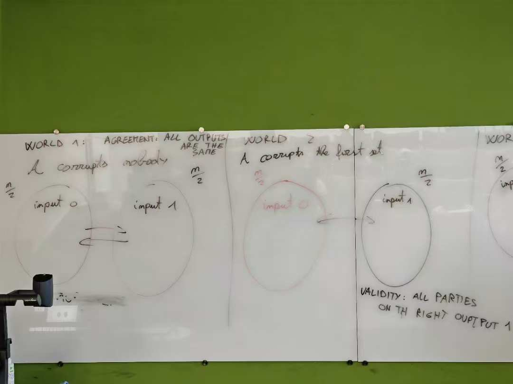
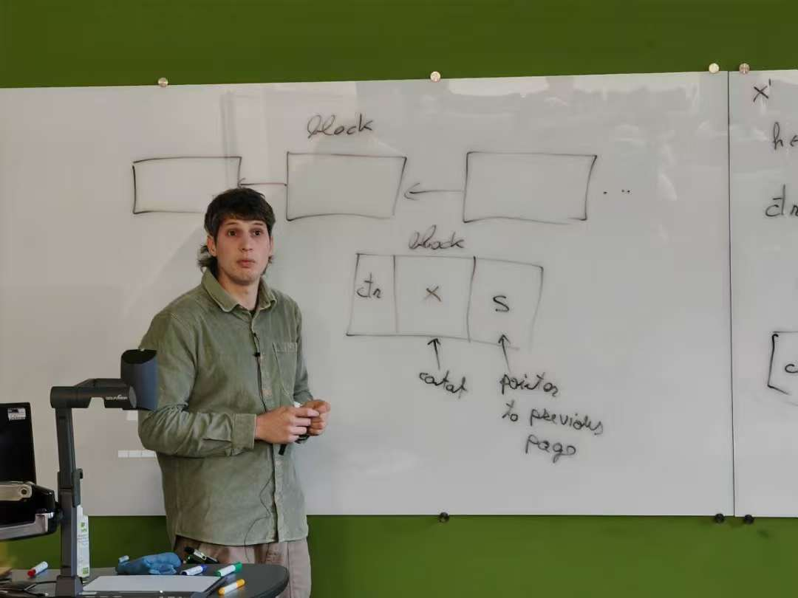
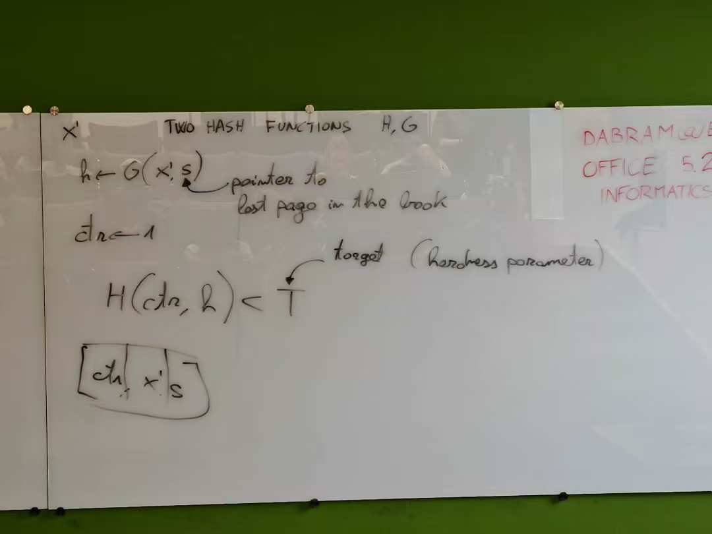

Distributed database that satisfies a unique set of safety and liveness properties


Hash Functions: Produce a fingerprint of a file
- SHA-256 for bitcoin
Collision resistance: find a `y` for given `x` that **H(x) = H(y)**

Pre-image attack 
One-way functions: P != NP

Digital Signatures, producesd by one specified entity
- depend on the file signing
Algos
- KeyGen: input security parameter --> signing-key, verificatoin-key
- Sign: sign the message with signing-key
- Verify: message and signature, varification-key

global matching


#### Verifications
File transfer and cloud storage: Authenticated protocols
- Don't trust, verify!

Hash-based vs Digital signature-based

##### Merkle Tree
- Binary, binary full and binary complete
- An authenticated binary tree;
- *BitTorrent*, to verify exchanged files
- *Bitcoin*, to store transactions

1. Split file into small chunks
2. Hash each chunk using a cryptographic hash function
3. combine them by two to create a binary tree, each node stores the **hash of the concat** of its children


**Merkle tree-based file stroage (sets of keys) protocol**
Client sends file data `D` to server  
Client creates Merkle Tree root `MTR` from initial file data `D`  
Client deletes data `D`, but stores `MTR` (32 bytes)

Client requests chunk `x` from server
Server returns chunk `x` and short proof-of-inclusion `π`  
Client checks whether proof `π` of chunk `x` is correct w.r.t. stored `MTR`

**Proof-of-inclusion**
1. Prover sends chunk
2. Prover sends **siblings** along path connecting leaf to `MTR`
3. Verifier computes hashes along the path connecting leaf to `MTR`
4. Verifier checks that computed root is equal to `MTR`


**Proof of non inclusion for x**
Show proof-of-inclusion for previous `H<` and next `H>` element in set
- proof-of-inclusion is correct
- they are adjacent in tree
- `H<` < `x` and `H>` > `x`


##### Tries
(radix tree, prefix tree)
- ordered data structre
- store an associative array
- keys are usually strings

Initialize with empty root, two operations
- *add(key, value)*
- *query(key)* -> value

*Patricia trie*: An isolated path, with unmarked nodes which are *only children*, is merged into single edge, the label is teh concat of the labels merged


*Merkle Patricia trie*
First implemented in Ethereum, for storage and transactions

Split nodes into three types
- *Leaf*: stores edge string leading to it, and **value**
- *Extension*: Stores **string** of a single node, **pointer** to next node, and **value** if node marked
- *Branch*: Stores one **pointer** to another node per alphabet symbol, and **value** if node marked

In Ethereum, 
- Encode keys as hex, alphabet size is 16
- Encode all chold edges in every node with some encoding like JSON


### Blockchain
Each block references (hash to) a previous block
A list of transactions
**Arrows show authenticated inclusion**

#### Blocks

- nonce (ctr): used to solve proof-of-work
- data (x)
	- in Bitcoin: financial data (`UTXO`-based)
	- in Ethereum: contract data (account-based)
- reference (s): pointer to the previous block by **hash**

Block validity: data valid (defined by application)

Proof-of-work equation, the value known as the **blockid**

- `T`: protocol-parameter


**Digital Signature Scheme**
- KeyGen(security_parameter) ==> <sk, vk>
	- signing/private key
	- verification/public key
- Sign<sk, m> ==> σ
	- m: message
	- σ: signature
- Verify<vk, m, σ> ==> {True, False}
#### Transactions
- Input: a proof of spending an existing UTxO
- Output: a varification procedure and a value

Each block contains a coinbase, only have outputs
coinbase 的 outputs 定义了谁能拿到矿工奖励以及如何花这笔钱


#### Bitcoin network
Each node connected to a common p2p network to its (network) neighbours, runs the Bitcoin protocol (open source code)

Each node can freely enter the network, no permission needed

***So, there is no trust placed on any specific node or participant, anyone individually mayulie***

**Peers**
Each node stores a list of peers (IP), when Alice connects to Bob, Bob sends Alice his own known peers, Alice can learn about new peers

"Known peers" can be extra specified when running a node

*gossip protocol*: peer to peer diffusion, when recieves some unfamiliar data, **broadcast** it, until whole network learns it

*Eclipse attacks*
Isolate some **hosest nodes** in the network, effectively causing a network split in two partitions A and B. If peers in A and peers in B are disjoint and don't know about each other, the ntworks will remain isolated
- ***liveness favoring operation***
被孤立的节点只能看到攻击者转发/伪造的消息，从而被驱动做出对攻击者有利的行为如：接收伪造的区块、丢失真实交易、执行双花等

*The connectivity assumption*
- There is a path between two nodes on the network
- If a node broadcasts a message, every other node **will** learn it

## Smart contract
A contract is a legally binding agreement that defines and governs the rights and duties between or among its parties

*Bitcoin Script*
- stack-based
- Notation: <>, data in the script
- Opcodes: commands for functions


## Ethereum
Transaction-based deterministic state machine
- global state
- decentralized applications/computing infrastructure
- stack-based
- turing-completeness

**Global state of Ethereum**: *accounts* which interact to each other through *transactions* (or *messages*)

### Ethereum Accounts
- *personal account*

- *contract account*


nonce: total transactions

### Ethereum Transactions
*Smart Contract*
Create -> Interact -> Destroy


*Signature*: sender's private key
*Data*:
- Create: *Smart contract code* + *initial arguments*
- Interaction: Which method to call + arguments

When contract account is activated:
- **Contract code** runs
- Read/write to internal storage
- Send other transactions or call other contracts

Can only send transactions when other transactions received

*Message*: a transaction except it is **produces by a contract**
- Exist only in the Ethereum execution environment
- Leads to the recipient account running its code
- Relationship with other contracts

Ethereum Virtual Machine
- A quashi Turing complete machine

Types of transactions


*Gas*: Every computationn step has a fee, unit in gas

`gasLimit`: 用户愿意为这笔交易最多提供多少gas
`gasUsed`: 实际执行过程中消耗的gas
- `maxFeePerGas` / `maxPriorityFeePerGas`
	- `maxFeePerGas`: 用户愿意支付的最高费用
	- `maxPriorityFeePerGas`: tips给区块提议者
	- `baseFee`: 由协议自动调整的底价, 随网络拥堵程度波动
$$gasUsed*(baseFee+priorityFee)$$


startgas & gasprice block
- all unused gas is refunded
- gas (price) raised determines how quickly a transaction will be included in a block

### Ethereum Block
Contain: transaction list and most recent state
Block time: 12 seconds


### Solidity
A high level programming language for writeing smart contracts on Ethereum, compile code for the *Ethereum Virtual Machine*
- look like classes
- Statically typed language

`pragma solidity ^0.8.1`enable certain compiler (version) features or checks

```solidity
contract <ContractName> {
	constructor (uint x, ...) { ... }
	
	address owner;
	address payable anotherAddress;
	
	enum State {Created, Locked, Inactive}
	
	mapping(address => uint256) balances;
	
	struct Voter {
		bool voted;
		...
	}
}
```

State variables
Local variables

##### Types

- 2 Category
	- Value types
	- Reference types
- Undefined or NULL not exist
- Uninitialised variables always have a default value (zero-state)
- C99

address
static and dynamic arrays
mappings: key => value
##### Visibility
public
external
internal
*private*: can be called only by the contract in which they are defined and not by a derived contract

##### Inheritance
interface
```solidity
interface Regulator {  
	... 
}  
contract Bank is Regulator {}
```

##### Data location
**Reference type**: storage and memory

##### Events, Modifiers and Global variables
EVM logging machanism, stored arguments
listeners

### Potential Attacks
#### Denial-of-Service

*Unbounded operation*: requires more gas as array become larger, reach the `gasLimit` ==> DoS, impossible to execute
*Griefing*: if a send/transfer call fails, the contract might get stuck
- it is possible to **force a call to fail**


##### solution
Design pattern: *pull over push*
- avoid multiple nested `send()` call in a single transaction
- Isolates each *external call* into its own transaction
- let users withdraw their funds, no `push()` transfer
- gas fairness
- A trade-off between security and user experience

#### Reentrancy


##### solutions
Design pattern *Checks-Effects-Interactions*
- Perform checks on outputs, sender, value etc.
- Enforce **effects** and update the **state** accordingly
- Interact with other accounts via external calls or send/transfer

Finish all **internal work** (state changes) and then call **external** functions

Mutexes

#### Solidity specific hazards
##### Forcibly Sending Ether to a Contract
misuse of `this.balance`
Send ether with `selfdestruct(victimContractAddress)` will not trigger contact's fallback
**Avoid strict equality checks with the contract's balance**

`delegatecall` forwards calls from one contract to another

tx.origin ==> `msg.sender`   onlyOwner

keep `fallback` and `receive` logically minimise
- only `emit event` in `fallback`

#### Default values
Solidity sign empty/zero value automatically for every uninitialised variable

*Nomad Bridge Hack*

Always check user input
Even never accessed before, it has zero value

Keep simple
复杂的自研证明/加密构造极易出错——**尽量使用成熟库、保持简单、避免自己重写加密/证明逻辑**

#### Front-running
> 攻击者在mempool“看见”你的交易要发生，于是花更高的 gas 费，让自己的交易先执行。

Public *mempool*

Cryptographic *Commitment scheme*

- Binding: a commitment can be opened only to its committed value
- Hiding: a commitment reveals no information about its committed value

Possible **DoS** and **forced gas cost**
User is forced to spend extra gas for new `tx` that posts new commitment
Attacker can continue front-running until they run out of money (to pay gas)

##### Generating Randomness
Insecure, can be manipulated by a **malicious miner**


Intra-transaction information leak
If same-block `txs` share randomness source, attacker can check whether conditions are favourable **before acting**

*validate block's age*
miner is still able to keep newly-minded blocks hidden

##### Solutions
*Commit-Reveal*


*2-party coin flipping via commitments*


#### Overflow/Underflow: number
`uint256` overflow/underflow in *Solidity* < 0.8

#### Gas Fairness


## The Consensus Problem
A transaction history and/or state of the service needs to be agreed by all servers
- participants with diverging intrests


Doesn't matter the parties input of the agreement: All outputs are the same

Bitcoin: a < 1/2
51% attack



##### Ledger Consensus Properties
*Consistency* $$\forall i,j \in \mathbf{H}, t,t' : (\text{Log}_i[t] \npreceq \text{Log}_j[t']) \rightarrow (\text{Log}_j[t'] \preceq \text{Log}_i[t])$$
对于任意两个诚实的参与者 `i` 和 `j`，以及任意时间点`t`,`t′`：
- 如果某一方的日志（账本）不是另一方日志的前缀，
- 那么反过来，另一方的日志一定是它的前缀。
所有诚实节点的账本是前缀关系，不会出现账本分叉或冲突

*Liveness* $$(\forall i \in \mathbf{H} : tx \in I_i[t]) \rightarrow (\forall i \in \mathbf{H} : tx \in \text{Log}_i[t + u])$$
where 
$\color{#bd93f9}I_j[t]$ is Transaction Input of party `j` at time `t` consistent with its log
$\color{#bd93f9}\text{Log}_j[t]$ is Log of party `j` at time `t`

对于任意一个诚实节点 `i`：
- 如果在时间 `t` 时它提交了一笔交易 `tx`, 
- 那么在经过某个有限的延迟时间 `u` 之后, 所有诚实节点的账本中都会包含这笔交易。
提交的交易最终都会上链，系统持续运行，交易最终确认

##### Bitcoin Blockchain


匿名性 不可关联性 无身份认证机制 无信任

- The chain validation predicate
- The chain selection rule (max-valid)
- The proof of work function
- The main protocol loop

#### Model
- `n` parties running the protocol
- Synchronous
- Each party has a quota of `q` queries to the function `H()` in each round
- A number of `t` parties are controlled by an adversary




Broadcast the whole book --> check the chain of hashes

#### Basis Properties
##### *Common prefix*  **(Consistency)** $$\forall r_1, r_2, (r_1 \le r_2), P_1, P_2, \text{ with } C_1, C_2 : C_1^{\lfloor k \rfloor} \preceq C_2$$
> 对任意两个诚实节点 `P1`,`P2` 在任意两个时间点 `r1`≤`r2`，
> 如果你从较早节点 `P1`​ 的区块链中去掉最后 `k` 个区块，
> 那么得到的链一定是另一个节点 `P2` 当前区块链的前缀。

所有诚实节点的区块链大部分一致，只有最近k个可能存在分歧
- **Racing**: Attacker splits from the main chain and tries to overtake the "honest chain"
- Confirmation depth: 6 confirmations
- The property holds true, in a probabilistic sense, with an error that decays exponentially in `k`.

##### *Chain Growth* **(Liveness)** $$Parameters\space\tau \in (0,1), \, s \in \mathbb{N}$$In any period of `s` rounds at least `τs` blocks are add to the chain of an honest party `P`. Where 
τ≈probability that at least one honest party finds a PoW in a round.
> 区块链会持续增长，不会陷入死锁，极大概率成立

##### *Chain Quality* **(Liveness)** $$\mu \in (0,1), \, \ell \in \mathbb{N}$$
The ratio of blocks of an `ℓ-long` segment of an honest chain produced by the adversary is bounded by `(1−μ)ℓ`
μ：链质量参数，表示诚实节点在该区段中占据的最小比例

> 在任意长度为`ℓ`的链区间中，至少有比例为`μ`的区块是由诚实节点产生的

The property holds true probabilistically with an error that exponentially decays in `ℓ`.


> 对手每获得 1 个主链区块，就最多能让 1 个诚实独占区块“失效”（成孤块）。 
> 所以诚实净贡献是“诚实独占 − 对手独占”。

> 只要 $t < \tfrac{n}{2}$，就有 $\mu>0$；当 $t \to \tfrac{n}{2}$​ 时，$\mu \to 0$。
> 当$\mu >  0$, 系统才具备自愈能力

*Block Withholding Attacks*
> Attacker mines privately and releases their block at the same time an honest party releases its own block
> Assuming honest propagation favours the adversary, the honest block is dropped, reducing chain quality

*Hash operations*: $2^{78}$ hashing operations

Mining pools parallelising: work together to solve PoW for the same block
- shares

#### Dynamic Availability
*T (PoW algorithm target)*: how difficulty of the Proof of Work algorithm (probability)

if T is small, the hardness increase
with the attendance increase, the hardness raise


0xAf0F1AEf2d28cCA39554335C9a79914512645A90