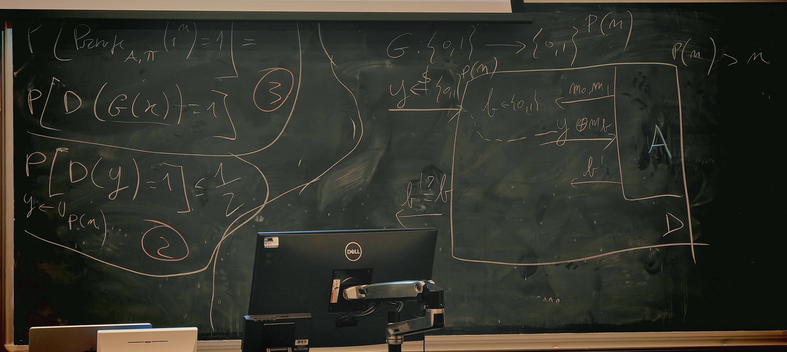
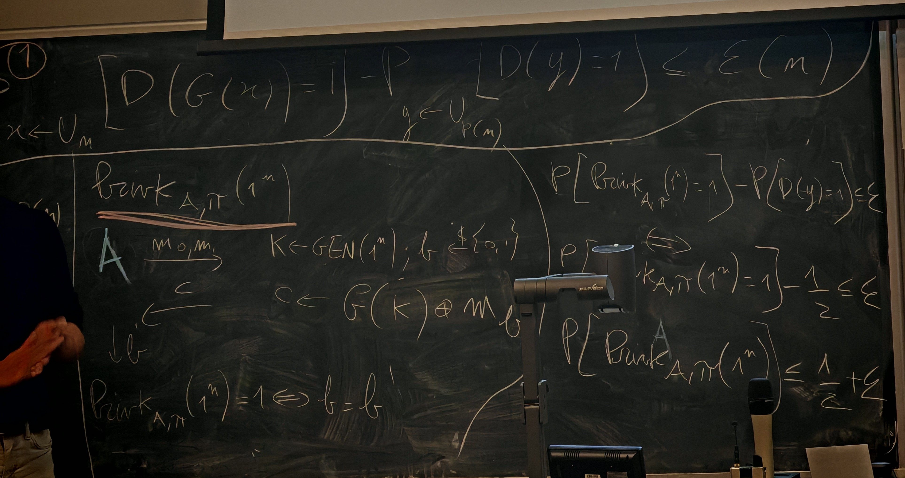

Proof something is secure
> The art of making and breaking secret codes

## Introduction
*Private-key (SK)*: Message authentication codes
*Public-key (PK)*: Digital signatures

**Private-key (symmetric-key) encryption**

*Kerckhoffs's principle*: The encryption scheme is not secret
- The attacker knows the encryption scheme
- The only secret is the key
- The key must be chosen at random; to kept secret

*Modular arithmetic*  同余&取模运算

*Byte-wise Shift Cipher*
- Alphabet of bytes rather than English letters
- Use XOR instead of modular addition (reversible)

The key space must be large enough to make brute-force attacks impractical

Shift Cipher
### Vigenere Cipher
**Index of Coincidence**

**Finding the key length**

Natural English Language IC: 0.065
Random IC: 0.038

$$26L+26^2L\approx26^2L\ll26^L$$

## Secure Encryption
*Three principles of modern cryptography*
- Definitions: Precise, mathematical model and formal definition of what security means
- Assumptions: Clearly stated and unambiguous
- Proofs: Prove security and move away from design-break-patch

**Goal (Security guarantee)**: What we want to prevent the attacker from achieving
**Threat model**: What capabilities the attacker is assumed to have
- Ciphertext-only attack (COA), 仅密文攻击
- Known-plaintext attack (KPA), 已知明文攻击
- Chosen-plaintext attack (CPA), 选择明文攻击
	- API接口
- Chosen-ciphertext attack (CCA), 选择密文攻击

> Regardless of any prior information the attacker has about the plaintext, the ciphertext should leak no additional information about the plaintext
> **加密后的密文不应该让攻击者在这些知识基础上得到任何新增优势**。

*Modern Cryptography*:
- Formal definition: evaluation & modularity
- Precise Assumptions
	- explicit
	- mathematically precise
- Proof of security, under two principles above

> A proof of security is always relative to the definition being considered and the assumption(s) being used.

The proof is irrelevant
- If the security guarantee does not match what is needed
- If the threat model does not capture the adversary's true abilities
- If the assumption that is relied upon turns out to be false

> Provable security of a scheme does not necessarily imply security of that scheme in the real world
> 可证明安全不必然等价于现实安全

要攻击一个“可证明安全”的方案，现实攻击者通常只能从两条路入手：
1. 针对**定义与现实环境的差距**（理想化模型遗漏了什么现实因素）
2. 针对**底层假设是否真的成立**（假设在实践中是否被打破或被削弱）

### Perfect Secrecy
*Random variable (RV)*: variable that takes on discrete values with certain probabilities

*Probability distribution (PD)*: A PD for a RV specifies the probabilities with which the variable takes on each possible value
- Each between 0 and 1
- Probabilities sum to 1

$$\sum_iP[A|E_i]\cdot P[E_i]=P[A]=\sum_i[E_i\land a]$$
$$P[A|B]=\frac{P[A\land B]}{P[B]}$$

Shift cipher 拥有固定的密文模式，从Chosen Ciphertext攻击中反推明文

*Perfect Secrecy*

每个加密后字符拥有同样的概率对应明文的每个字符, 即对密文的观察不会泄露任何关于明文的信息，在看到密文 c 的条件下，每个消息 m 都是可能的

*Bayes's theorem*
$$Pr[A|B]=\frac{Pr[B|A]Pr[A]}{Pr[B]}$$

### One-time Pad

**The One-time Pad satisfies perfect secrecy**
- Any observed ciphertext can correspond to any message
- Having observed a ciphertext, the attacker cannot conclude for certain which message was sent

#### Brute-force Attack Resisting

#### Use the same key twice

#### Optimality of the One-time Pad
> If `(Gen, Enc, Dec)` with message space M is perfectly secret, then $|\mathrm{K}|\ge\mathrm|M|$ 
> 
> 对于指定的密文c, 令$S_c=Dec_k(c),k\in\mathcal{K}$ (key space) ，其必须与$\mathcal{M}$相等，即令每一条可能的密文都对应所有可能的明文。如$|\mathcal{K}|<|\mathcal{M}|$，则可以通过穷举$\mathcal{K}$得到$|S_c|=|\mathcal{K}|$的完整消息空间，找到$\mathcal{M}$中没有对应的消息m\*，以排除指定消息。这不符合无多余信息泄露的标准。

## Perfect Indistinguishability
Randomized experiment, equivalent with PS
*Perfect Indistinguishability (PI)*

$D_m$: 明文空间m和密钥空间k对应的密文空间

对手通过观察加密后的内容得到的信息与没加密前一致
For all attacker a, no matter what he does

### Computational Secrecy
*Relax perfect indistinguishability*
Little weaker
#### Computational Indistinguishability (Concrete security)
Security may fail with probability $\le\varepsilon$
Restrict attention to attackers running in time/CPU cycles $\le$ t

**$(t,\varepsilon)$-indistinguishable** $$Pr[\textsf{Priv}K_{A,\pi}=1]\le \frac{1}{2}+\varepsilon$$
#### Asymptotic security
Security parameter $\color{#b293f6}n$
- chosen by honest parties when they generate/share keys
- **known by adversary**

Security may fail with probability **negligible** in n
Restrict attention to attackers running in time **polynomial** in n

*Polynomial function*

*Negligible function*

当n大过一个阈值之后，$f(n)$小于任何多项式$p(n)$

$2^{-n}$, $2^{-\sqrt n}$, $\frac{1}{n^{\log n}}$

efficient = *probabilistic polynomial-time (PPT)*

$1^n=\underbrace{11\cdots1}_{\text{n times}}$, denotes the algorithm is polynomial in n

When computer get faster, a tiny increase of n could compensate the gap, the scheme still remain secure

## Pseudorandomness
*Random*
Sample a random element according to **some distribution**

*Uniform*
Sample an element uniformly at random means to sample according to the uniform distribution

If we generate a uniform 16-bit string, each of the above occurs with probability $2^{-16}$

*Uniformity*

*Pseudorandom*: cannot be distinguished from uniform
- Pseudorandomness is a property of a **distribution**
- looks like random

> $D$ is pseudorandom if it passes all efficient statistical tests

> 任何“算力不超过t” 的攻击者 A，都几乎分不清样本来自 D 还是来自真正均匀随机$U_p$，概率差最多$\epsilon$

### Asymptotic Pseudorandomness
- parameter $n$, polynomial $p$
- Let $D_n$ be a distribution over $p(n)$-bit strings
- Pseudorandomness is a property of a sequence of distributions $${D_n}=\{D_1,D_2,\cdots\}$$

### Pseudorandom Generators (PRG)
> $G$ is a deterministic, poly-time algorithm that is expanding $$|G(x)|=p(|x|)>|x|$$

The PRGs exist requires the unproven assumption $\mathcal{P}\ne\mathcal{NP}$ 
**We assume certain algorithms are PRGs**

## Pseudo One-Time Pad (POTP)

Secure: prove under definition of indistinguishability

### Proof by Reduction
**Modern Crypto = Definitions + Proofs + Assumptions**

> If G is a pseudorandom generator, then the pseudo one-time pad $\Pi$ is EAV-secure (computationally indistinguishable)

Assume G is a pseudorandom generator
Use A as a subroutine to build an efficient D attacking G
Relate the distinguishing gap of D to the success probability of A
- By assumption, the distinguishing gap of D must be negligible

Reduce the security of the POTP to the security of the underlying G

POTP 的破解优势不会比你能破解 PRG 的优势更大

The POTP has a key shorter than the message:
- n bit vs p(n) bits

More problem
small key, same key many encryption problem