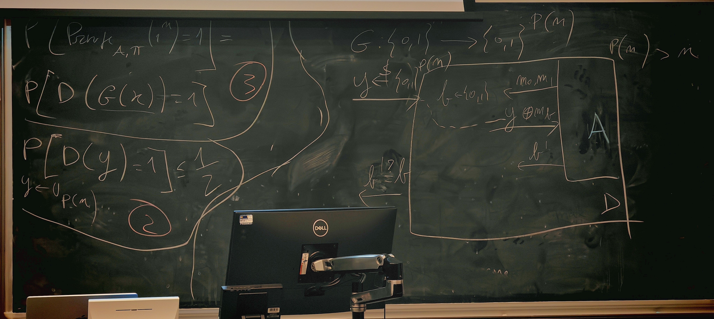
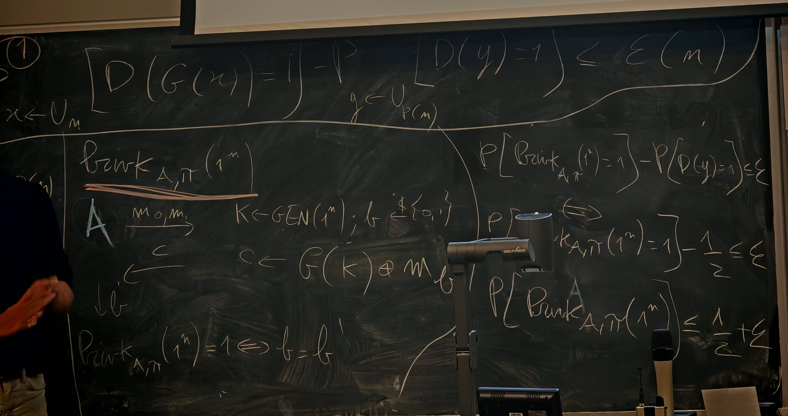

Proof something is secure
> The art of making and breaking secret codes

## Introduction
*Private-key (SK)*: Message authentication codes
*Public-key (PK)*: Digital signatures

**Private-key (symmetric-key) encryption**

*Kerckhoffs's principle*: The encryption scheme is not secret
- The attacker knows the encryption scheme
- The only secret is the key
- The key must be chosen at random; to kept secret

*Modular arithmetic*  同余&取模运算

*Byte-wise Shift Cipher*
- Alphabet of bytes rather than English letters
- Use XOR instead of modular addition (reversible)

The key space must be large enough to make brute-force attacks impractical

Shift Cipher
### Vigenere Cipher
**Index of Coincidence**

**Finding the key length**

Natural English Language IC: 0.065
Random IC: 0.038

$$26L+26^2L\approx26^2L\ll26^L$$

# Symmetric Cryptography
## Secure Encryption
*Three principles of modern cryptography*
- Definitions: Precise, mathematical model and formal definition of what security means
- Assumptions: Clearly stated and unambiguous
- Proofs: Prove security and move away from design-break-patch

**Goal (Security guarantee)**: What we want to prevent the attacker from achieving
**Threat model**: What capabilities the attacker is assumed to have
- Ciphertext-only attack (COA), 仅密文攻击
- Known-plaintext attack (KPA), 已知明文攻击
- Chosen-plaintext attack (CPA), 选择明文攻击
	- API接口
- Chosen-ciphertext attack (CCA), 选择密文攻击

> Regardless of any prior information the attacker has about the plaintext, the ciphertext should leak no additional information about the plaintext
> **加密后的密文不应该让攻击者在这些知识基础上得到任何新增优势**。

*Modern Cryptography*:
- Formal definition: evaluation & modularity
- Precise Assumptions
	- explicit
	- mathematically precise
- Proof of security, under two principles above

> A proof of security is always relative to the definition being considered and the assumption(s) being used.

The proof is irrelevant
- If the security guarantee does not match what is needed
- If the threat model does not capture the adversary's true abilities
- If the assumption that is relied upon turns out to be false

> Provable security of a scheme does not necessarily imply security of that scheme in the real world
> 可证明安全不必然等价于现实安全

要攻击一个“可证明安全”的方案，现实攻击者通常只能从两条路入手：
1. 针对**定义与现实环境的差距**（理想化模型遗漏了什么现实因素）
2. 针对**底层假设是否真的成立**（假设在实践中是否被打破或被削弱）

### Perfect Secrecy
*Random variable (RV)*: variable that takes on discrete values with certain probabilities

*Probability distribution (PD)*: A PD for a RV specifies the probabilities with which the variable takes on each possible value
- Each between 0 and 1
- Probabilities sum to 1

$$\sum_iP[A|E_i]\cdot P[E_i]=P[A]=\sum_i[E_i\land a]$$
$$P[A|B]=\frac{P[A\land B]}{P[B]}$$

Shift cipher 拥有固定的密文模式，从Chosen Ciphertext攻击中反推明文

*Perfect Secrecy*

每个加密后字符拥有同样的概率对应明文的每个字符, 即对密文的观察不会泄露任何关于明文的信息，在看到密文 c 的条件下，每个消息 m 都是可能的

*Bayes's theorem*
$$Pr[A|B]=\frac{Pr[B|A]Pr[A]}{Pr[B]}$$

### One-time Pad

**The One-time Pad satisfies perfect secrecy**
- Any observed ciphertext can correspond to any message
- Having observed a ciphertext, the attacker cannot conclude for certain which message was sent

#### Brute-force Attack Resisting

#### Limitations of OTP
1. **The key is as long as the message**
2. **A key must be used only once**

Only Secure if each key is used to encrypt a single message

Parties must share keys of (total) length equal to the (total) length of all the message they might ever send

#### Optimality of the One-time Pad
> If `(Gen, Enc, Dec)` with message space M is perfectly secret, then $|\mathrm{K}|\ge\mathrm|M|$ 
> 
> 对于指定的密文c, 令$S_c=Dec_k(c),k\in\mathcal{K}$ (key space) ，其必须与$\mathcal{M}$相等，即令每一条可能的密文都对应所有可能的明文。如$|\mathcal{K}|<|\mathcal{M}|$，则可以通过穷举$\mathcal{K}$得到$|S_c|=|\mathcal{K}|$的完整消息空间，找到$\mathcal{M}$中没有对应的消息m\*，以排除指定消息。这不符合无多余信息泄露的标准。

## Perfect Indistinguishability
Randomized experiment, equivalent with PS
*Perfect Indistinguishability (PI)*

$D_m$: 明文空间m和密钥空间k对应的密文空间

对手通过观察加密后的内容得到的信息与没加密前一致
For all attacker a, no matter what he does

### Computational Secrecy
*Relax perfect indistinguishability*
Little weaker
#### Computational Indistinguishability (Concrete security)
Security may fail with probability $\le\varepsilon$
Restrict attention to attackers running in time/CPU cycles $\le$ t

**$(t,\varepsilon)$-indistinguishable** $$Pr[\textsf{Priv}K_{A,\pi}=1]\le \frac{1}{2}+\varepsilon$$
#### Asymptotic security
Security parameter $\color{#b293f6}n$
- chosen by honest parties when they generate/share keys
- **known by adversary**

Security may fail with probability **negligible** in n
Restrict attention to attackers running in time **polynomial** in n

*Polynomial function*

*Negligible function*

当n大过一个阈值之后，$f(n)$小于任何多项式$p(n)$

$2^{-n}$, $2^{-\sqrt n}$, $\frac{1}{n^{\log n}}$

efficient = *probabilistic polynomial-time (PPT)*

$1^n=\underbrace{11\cdots1}_{\text{n times}}$, denotes the algorithm is polynomial in n

When computer get faster, a tiny increase of n could compensate the gap, the scheme still remain secure

## Pseudorandomness
*Random*
Sample a random element according to **some distribution**

*Uniform*
Sample an element uniformly at random means to sample according to the uniform distribution

If we generate a uniform 16-bit string, each of the above occurs with probability $2^{-16}$

*Uniformity*

*Pseudorandom*: cannot be distinguished from uniform
- Pseudorandomness is a property of a **distribution**
- looks like random

> $D$ is pseudorandom if it passes all efficient statistical tests

> 任何“算力不超过t” 的攻击者 A，都几乎分不清样本来自 D 还是来自真正均匀随机$U_p$，概率差最多$\epsilon$

### Asymptotic Pseudorandomness
- parameter $n$, polynomial $p$
- Let $D_n$ be a distribution over $p(n)$-bit strings
- Pseudorandomness is a property of a sequence of distributions $${D_n}=\{D_1,D_2,\cdots\}$$

### Pseudorandom Generators (PRG)
> $G$ is a deterministic, poly-time algorithm that is expanding $$|G(x)|=p(|x|)>|x|$$

The PRGs exist requires the unproven assumption $\mathcal{P}\ne\mathcal{NP}$ 
**We assume certain algorithms are PRGs**

## Pseudo One-Time Pad (POTP)

Secure: prove under definition of indistinguishability

### Proof by Reduction
**Modern Crypto = Definitions + Proofs + Assumptions**

> If G is a pseudorandom generator, then the pseudo one-time pad $\Pi$ is EAV-secure (computationally indistinguishable)

Assume G is a pseudorandom generator
Use A as a subroutine to build an efficient D attacking G
Relate the distinguishing gap of D to the success probability of A
- By assumption, the distinguishing gap of D must be negligible

Reduce the security of the POTP to the security of the underlying G

POTP 的破解优势不会比你能破解 PRG 的优势更大

The POTP has a key shorter than the message:
- n bit vs p(n) bits

More problem: small key, same key many encryption problem

## Security Against Chosen-Plaintext Attacks (CPA)
*Multiple-message Secrecy (MMS)*: Parties share $k$; multiple $m_i$; encrypted under $k$
- Threat model: attacker observes multiple ciphertexts $c_i$
- Security goal: given $c_i$ attacker can not derive any information on any $m_i$

多次查询，定制m1m2，返回正确结果

构建vector0 两条相同的内容，vector1 两条不同的内容

> CPA is the minimal notion of security an encryption scheme should satisfy
> If $\Pi$ is CPA-secure ==> $\Pi$ is multiple-message indistinguishability

> No deterministic encryption scheme can be CPA-secure
> Consider randomized scheme

## Pseudorandom functions (PRF)
Choosing $f$ uniformly at random, interacting with oracle $f$
is equivalent to
For each $x \in \{0,1\}^n$, choose $f(x)$ uniformly in ${0,1}^n$

随机选f一直用 和 为每个x随机选择一个f

$\mathcal{F_n}$ = all functions mapping $\{0,1\}^n$ to $\{0,1\}^n$
- $2^{n\cdot 2^{n}}$ functions in total

*Keyed functions*

**Length-preserving**: $|k|=|x|=|F(k,x)|$, inputs and output of equal size

$F_k$ naturally induces a distribution on functions from $\mathcal{F_n}$
But only a tiny fraction of $\mathcal{F_n}$, with at most $2^n$

定义n长度uniform key的函数F，与从函数群选择一个uniform函数，产生的结果概率相等

D can query $f$ (resp. $F_k$) on any input $x$ at most poly times
**The key must be unknown by D**

### Pseudorandom permutations (PRP)

*Keyed Permutations*

*Pseudorandom Permutation*

> A random permutation is indistinguishable from a random function for large enough n
- In practice PRPs are also good PRFs

## CPA-secure encryption using PRF/PRP

将随机数r引入，使掩码每次都不同，又使用相同的$F_k$使其可复原
r被同样发送，只有正确的k可以复原，解决重复加密问题
PRG生成的均匀随机

i.e. If encrypt multiple messages with same key, output
$$\forall m, m'\space\space Enc(k,m)\ne Enc(k,m')$$

> If $F$ is a pseudorandom function then $\Pi$ is CPA-secure

**Proof**
Distinguisher D that uses A as a subroutine to attack the PRF $F$
D simulates to A the steps in the $PrivK^{cpa}_{A,\Pi}(n)$ experiment for $F$ and for a RF

$A$ succeeds ==> $D$ succeeds ==> $F\ne$ PRF
$$P_{k\leftarrow\{0,1\}}[D^{F(k,\cdot)}=1]=P[PrivK_{A,\Pi}^{CPA}(1^m)=1]$$
Contradicts $F$ PRF ==> A can not succeed ==> $\Pi$ CPA-secure

**World 0: Truly Random Function $f$**
Security assuming $f$ (a random function) is never evaluated on the same input twice, except with negligible probability
- Clarification PDF: cpa-secure-encryption.pdf

重用r问题: the encryption is deterministic
A can make at most $q(n)$ polynomial number or queries
As $r_c$ is chosen uniformly, it follows
在uniform随机下出现重复r的几率
$$Pr[\mathtt{Repeat}]=\frac{q(n)}{2^n}$$
$$Pr[\mathtt{\lnot Repeat}]=1-\frac{q(n)}{2^n}=1-negl\approx1$$

When $r$ is a uniform, n-bit string, the probability of a repeat is negligible

**Attacks**
- Nonce $r$ not used correctly
	- repeats
	- too short
	- chosen from another distribution
- $F$ not used correctly
	- plaintext leaked $\langle m,F_k(m)\rangle$
	- wrong key $\langle r,F_r(m)\rangle$

**Problems**
- 1-block plaintext ==> 2-block ciphertext
- OTP limitation 1: same length of encryption

## Block Ciphers and Stream Ciphers
Problem of encrypting long messages: ciphertext expansion by a factor of 2

*Mode of Operation (MO)*
PRP/PRF ==> block cipher
PRG ==> stream cipher
### Block Cipher MO

AES: 128，192，256 bits key length and 128 bits block length
密钥不等长的加密
$\mathrm{P}_m$空间里的随机置换模式，c=2也无法确认$F_k$

*ECB Mode*

Deterministic ==> not CPA-secure

*CTR Mode*

If $F$ is a PRF, then CTR mode is CPA-secure

*CBC Mode*

If $F$ is a PRP, then CBC mode is a CPA-secure
难以Dec，需要$F^{-1}(c_3)$逆运算

*OFB Mode*

### Stream Cipher MO
Practical realization of PRGs
Producing an infinite stream of pseudorandom bits

## Security Against Chosen-Ciphertext Attacks (CCA)
Active attackers, corrupted, injecting traffic on the channel
No more assume that the ciphertext can reach the receiver **unchanged**

detecting the modification

*Malleability*: A scheme is malleable if it is possible modify a ciphertext cause **a predictable change to the plaintext**
- a perfectly secret scheme may still be malleable

*Chosen-ciphertext Attacks (CCA)*
Models settings in which the attacker can influence what gets decrypted, and observe the effects

A is allowed to interfering and **modify** c to c', and forward c' to the receiver
- has access to both encryption and decryption oracle
- obtain the decryption of **any ciphertext of its choice**, beside the challenge ciphertext

CCA-security implies non-malleability
- modification of c to c′ predictably modifies m to m′

As much as secure

## Message Integrity
*Integrity*
- originated from the intended sender and
- was not modified

**Not concerned with secrecy, message m transmitted in the clear**
Passive Attacks ==> Active Attacks
Adaptive chosen-message attack

*Message Authentication Code (MAC)*

Secure MAC ==> infeasible to forage even a single message

MACs **do not prevent replay attacks**
No stateless mechanism can prevent replay attacks

### Fixed-length MAC

Let Mac be a PRF, set $Mac_k\equiv F_k$
F is a PRF ==> $\Pi$ is a secure MAC

### Variable-length MAC
Break a long message into multiple fixed length string and do fixed-length MAC respectively

Prevent: 
- Block reordering
- Truncation
- Mixing-and-matching blocks from multiple messages

*Basic CBC-MAC*

不需要逆运算, Deterministic, verification done by re-computing the result

> If F is a length-preserving PRF with input length $n$, then for any fixed $l$ basic CBC-MAC is a secure MAC for messages of length $ln$

  
The sender and receiver must agree on the length parameter $l$ in advance, **Basic CBC-MAC is not secure if this is not done**!
分组数不符会导致长度扩展攻击，构造一个相同tag的内容

## Hash Functions
> Deterministic function mapping arbitrary length inputs to a short, fixed-length output (a digest)

*Collision-resistance*

Collisions are guaranteed to exist
**Generic collision attack** on a hash function ==> brute force

*Birthday attack*
The collision probability is $\mathcal{O}(k^2/N)$
- N is the enumeration space
- take k samples (k time hashes)
When $k\approx \sqrt{N}$, probability of a collision is $\approx 50\%$
**$k\approx\sqrt{2^l}$ hash-function evaluations**

> 攻击者通常只需要找到**任意两个**能产生相同哈希值的输入即可伪造签名或破坏完整性。
> To protect against attackers running in time 2n we need the output of our hash function to be l = 2n

**The birthday bound $k\approx2^{n/2}$**
- CTR-mode IV reuse

### Hash function building
Fixed-length inputs hash $h$
Hash function $H$

> Prove that collision resistance of $h$ implies collision resistance of $H$

*Merkle-Damg ̊ard Transform*

（长度扩展攻击问题）

SHA-2 (use Merkle-Damgard transform), SHA-3
- 224, 256, 384, 512-bit outputs

### Hash-and-MAC
MAC a reliable short messages channel

Not necessary to transmit h as B can recompute it from M

*HMAC*
For matching block-length, need to implement two crypto primitives
- block cipher and hash function

A practical instantiation of the hash-and-MAC paradigm, Follows the hash-and-MAC approach with (part of) the hash function being used as a PRF

$$HMAC_K(M) = H((K \oplus \text{opad}) \parallel H((K \oplus \text{ipad}) \parallel M))$$

**randomness should never be reused or correlated**
## Authenticated Encryption
**Combined secrecy and integrity**
- Secrecy: PRF/block cipher in a mode of operation
- Integrity: message authentication code

### Encrypt-and-Authenticate (E-and-A)

- 使用的MAC是deterministic，则**不CPA-secure**，相同的明文生成的tag会完全相同，与加密算法无关
- MAC使用直接暴露明文的scheme，则**不EVA-secure**
	- $MAC’_k(m)=(m,MAC(m))$ 依然是安全MAC

### Authenticate-then-Encrypt (A-then-E)

没有指定使用的MAC和Enc scheme
受到*Oracle Padding Attack*，则**不CCA-secure**

流密码允许攻击者通过翻转密文位来精准改变解密后的结果，Oracle需要先解密再验证MAC，攻击方通过Oracle解密时的Padding错误返回信息，**直接获取明文**
padding：有冗余位，多携带了信息，将其利用作为错误返回的指示
authenticate没有起作用，直接获取了明文
### Encrypt-then-Authenticate (E-then-A)

E和A二者相互独立，互不影响
- CPA-secure encryption scheme to encrypt the message
- MAC to prevent the ciphertext from being modified

Stronger notion than CCA
- The MAC is applied on the ciphertext produced by the sender
- CCA-security中adversary可以使用chosen ciphertexts访问decryption oracle的特性失去作用，因为**接收方会先验证MAC**，一切修改c为c'再询问oracle的操作无法通过authentication，无法返回有效的结果
- 直接隔离oracle padding attack的可能性
- **Authenticated Encryption (AE) scheme**

> If the underlying encryption scheme is CPA-secure and the MAC is secure (i.e. existentially unforgeable) then the E-then-A combination is a AE scheme

Using any CPA-secure scheme + any secure MAC to construct an AE scheme
- OCB, CCM, GCM

# Public Key Cryptography
## Number Theory and Cryptographic Hardness Assumptions
### Modular Arithmetic

If for a given integer `b` there exists an integer `c` such that $\color{#b293f6}bc = 1~mod~N$, we say that `b` is *invertible modulo* `N` and call `c` a *multiplicative inverse* of `b` modulo `N`.

`c` is *unique multiplicative inverse* of `b` that lies in the range $\{1,\dots,N-1\}$ and denoted $\color{#b293f6}b^{-1}$, also the division by `b`
唯一逆元

If $ab = cb$ mod N and b is invertible, then we have that 
$$(ab) \cdot b^{−1} = (cb) \cdot b^{−1}\bmod N ⇒ a = c\bmod N$$

> Let b, N integers with $b \ge 1$ and $N \gt 1$. Then b is invertible module N if and only if $gcd(b, N)=1$ 

### Groups
A group is a set $\mathbb{G}$ along with a binary operation $\circ$ for which the following conditions hold:
- *Closure*: For all $g, h \in \mathbb{G}$, $g\circ h\in \mathbb{G}$
- *Existence of identity*: There exists an **identity** element $e\in\mathbb{G}$ such that for all $g\in\mathbb{G}$, $e\circ g=g=g\circ e$
	- 单位元 基础元素 中心元素
- *Existence of inverse*: For all $g\in\mathbb{G}$ there exists an element $h\in\mathbb{G}$ such that $g\circ h=e=h\circ g$. Such an $h$ is called an **inverse** of $g$
	- the inverse $h$ of $g\in\mathbb{G}$ is unique
- *Associativity*: For all $g_1, g_2, g_3 \in\mathbb{G}$, $(g_1\circ g_2)\circ g_3=g_1\circ(g_2\circ g_3)$

A group $\mathbb{G}$ with operation $\circ$ is *abelian* if the following holds:
- *Commutativity*: For all $g, h\in\mathbb{G}$, $g\circ h=h\circ g$

A set $\mathrm{H}\subseteq\mathbb{G}$ is a **subgroup** of $\mathbb{G}$ if itself forms a group under the same operation associated with $\mathbb{G}$

If $\mathbb{G}$ is **finite** if it has finite number of elements.
The number of elements is the **order** of $\mathbb{G}$, denoted by $|\mathbb{G}|$

#### Examples
The set {0, . . . , N − 1} with respect to addition modulo N is an abelian group of order N with identity 0. The inverse of a is $(N − a)\bmod N$. We denote this group by $\mathbb{Z}_N.$

The set of **invertible elements** modulo N is an abelian group under multiplication with identity 1. Namely, $$\mathbb{Z}_n^*\overset{def}{=}\{b\in\{1,\dots,N-1\}|gcd(b,N=1)\}$$模N下所有**可逆元素**组成的集合
- Inverse of $b$: use **extended Euclidean algorithm** to find $x,y$ such that $bx+Ny=gcd(b,N)=1$. Then $x\bmod N$ is the inverse of b modulo N.
- Closure: let $a,b\in\mathrm{Z}_N^*$. Then $(ab)\bmod N$ has inverse $(b^{-1},a{-1})\bmod N$ so $ab\in\mathbb{Z}_N^*$

Special case: for prime p, it holds that $$\mathbb{Z}_p^*=\{1,2,\dots,p-1\}$$
Let $\mathbb{G}$ be a finite group with $m=|\mathbb{G}|$. Then for every element $g\in\mathbb{G},g^m=1$

Let $\mathbb{G}$ be a finite group with $m=|\mathbb{G}|\gt1$. Then for every element $g\in\mathbb{G}$and every integer $x$, we have $g^x = g^{x \bmod m}$
在指数运算中，指数是可以用群的阶 $m$ 来取模的，即 $g^x = g^{x \bmod m}$

The *order of element* ==> subgroup of $\mathbb{G}$
Must divisible to $|\mathbb{G}|$

$\mathbb{G}$ is *cyclic* if it has *generator* that generates all elements of $\mathbb{G}$
$g^x\in\mathbb{G}$

Group with prime order $p$ is cyclic group, all elements are generators
素数阶群一定是循环群

### The discrete logarithm problem
Let $\mathcal{G}$ denote a generic PPT group generation algorithm
- input $1^n$ outputs a description of a cyclic group $\mathbb{G}$
- order $q$
- generator $g\in\mathbb{G}$
For every $h\in\mathbb{G}$ there is a **unique** $x\in\mathbb{Z}_q$ such that $g^x=h$, we call $x$ the *discrete logarithm* of $h$ with respect to $g$ 离散对数
- $g^x=h$ ==> $log_g~h$

> We say that discrete logarithm problem is hard relative to $\mathcal{G}$, if for all PPT adversaries $\mathcal{A}$, it holds that $$Pr[\mathsf{DLog}_{\mathcal{A,G}}(n)=1]\le negl(n)$$

### The computational Diffie-Hellman problem

> We say that the CDH problem is hard relative to $\mathcal{G}$, if for all PPT adversaries $\mathcal{A}$, it holds that $$Pr[\mathsf{CDH}_\mathcal{A,G}(n)=1]\le negl(n)$$

### The decisional Diffie-Hellman problem

> We say that the DDH problem is hard relative to $\mathcal{G}$ if for every PPT adversary $mathcal{A}$, it holds that $$|\Pr[\mathcal{A}(\mathbb{G},q,g,g^x,g^y,g^z)=1]-\Pr[\mathcal{A}(\mathbb{G},q,g,g^x,g^y,g^{xy})=1]|\le negl(n)$$, where in each case the probabilities are taken over the experiment $\mathsf{DDH}_\mathcal{A,G}(n)$

> ***Large prime order subgroups of $\mathbb Z_p^*$, where $p$ prime, are believed to be safe.

选$\mathbb Z_p^*$里的**大素数阶子群**。

$r$ 必须是 $p-1$ 的因数
当$p=2q+1$ (r=2)时, 会得到一个阶正好为q的子群

## Key Exchange and the Diffie-Hellman Protocol
**An interactive protocol**

> A key-exchange protocol $\Pi$ is secure in the presence of an eavesdropper if for every PPT adversary $\mathcal A$, it holds that $$Pr[\mathsf{KE}_{\mathcal A,\Pi}^{\mathsf{eav}}(n)=1]\le\frac{1}{2}+negl(n)$$

### The Diffie-Hellman key-exchange protocol

**Proof**
Considering the experiment $\widehat{\mathsf{KE}}_{\mathcal A,\Pi}^{\mathsf{eav}}$, where if $b = 1$, the adversary is given $\hat k$ chosen uniformly from $\mathbb G$ instead from a uniform n-bit string
需要A区分的随机元素(b=1)是随机从群中选择的而不是$\{0,1\}^n$

> If the DDH problem is hard relative to $\mathcal G$, then the Diffie-Hellman key-exchange protocol is secure in the presence of an eavesdropper

Active attacks: man-in-the-middle attack
- able to modifying messages

## Hybrid proof

## Public-key Encryption and the El Gamal and RSA Encryption Schemes
Parties can communicate securely without having agreed on any secret information in advance

Every one who know key public key can encrypt

Against Chosen-Plaintext attacks

### El Gamal encryption

虽然 $M$ 是固定的，但因为 $k$ 是完全随机的，所以乘出来的结果 **$k'$ 也会在整个群 $\mathbb{G}$ 中呈现绝对的均匀随机分布**

在群中，随机选一个k等于一个固定值的概率就是$\frac{1}{|\mathbb G|}$
群论one-time pad

在Enc中使用$<g^y,g^z\cdot m>$, 则结果m是完全随机的内容 $$\Pr[\mathsf{PubK}_{\mathcal A,\tilde\Pi}^{\mathsf{eav}}(n)=1]=\frac{1}{2}$$又, 正常Enc$<g^y,g^{xy}\cdot m>$ $$\Pr[\mathsf{PubK}_{\mathcal A,\Pi}^{\mathsf{eav}}(n)=1]=\Pr[\mathcal{D}(\mathbb{G},q,g,g^x,g^y,g^{xy})=1]$$所以 $$\Pr[\mathsf{PubK}_{\mathcal A,\Pi}^{\mathsf{eav}}(n)=1]\le\frac{1}{2}+\mathsf{negl}(n)$$

**Malleability of El Gamal**
you can do operation with different calculation

When the adversary is able to access the decryption oracle
Not CCA secure
### RSA

找到与$\phi(N)$互质的元素e
- 对于$x\in\mathbb Z_N^*$, $x^e$是随机的元素permutation
- 一定存在逆元$d=e^{-1}\bmod \phi(N)$, 可以用于恢复密文

*Euler's Theorem*: if $M$ and $N$ are coprime, then $$M^{\phi(N)}=1\bmod N$$
N是质数, 其空间$\mathbb Z_N^*$下所有数即都和它互质, 包括信息$M$
RSA is deterministic, therefore it **not CPA-secure**

## Digital Signatures
### Random Oracles
Take some input, it outputs looking random
$$H:\{0,1\}^*\rightarrow Y$$
*Consistent*: if a question is repeated, the random oracle must return the same answer
> If a scheme is secure assuming the adversary views some hash function as a random oracle, it is said to be secure in the **Random Oracle Model**

$(M,t)\in\mathsf{History}$ for $t\xleftarrow{\$} Y$

Not available in the real world

Oracle: Adversary cannot really access except input and output

Reduction can observe the scheme, and fully control its distribution of output

Better in formal justification than no proof

### Digital signature
- A *signer* S has a unique private signing key and publishes the corresponding public verification key
- S signs a message M and everyone who knows the public key can verify that M originated form the signer S

$\mathsf{Gen}(1^n)\gets(sk, vk)$ 
$\mathsf{Sign}(sk,M)=\sigma$
$\mathsf{Verify}(vk,M,\sigma) = 1$ if signature is valid, 0 otherwise

The digital signature scheme(Gen,Sign,Verify) has **existential unforgeability under adaptive chosen message attacks** (EUF-CMA) if for every PPT adversary0 $\mathcal A$, it holds $$\Pr[\text{Game}_{EUF-CMA}^{\mathcal A^{\mathsf{Sign}}}(1^n)=1]\le\mathsf{negl}(n)$$
A无法得知oracle内部的工作方式

**Trapdoor One-way Function (TOWF)**
- Easy to compute
- Hard to invert
- Easy to invert *with trapdoor*
Only success if having trapdoor $z$

**Correctness**

**Unforgeability**

> 任何“会伪造签名的人”，都能被改造成“会求 $f_e$​ 原像的人”。所以如果 $f_e$​ 真的是 one-way function，那么伪造签名的人就不该存在。

B 来对A伪装Sign和H

> 伪造签名，本质上就是给某个哈希值找原像；而 random oracle 允许 reduction 把这个哈希值编程成 one-way challenge，因此签名伪造者就能被转化成 one-way inverter。

creates a forgery
A: adversary of signature scheme
B: forgery of OWF scheme

**Conditional Independency**
$$\Pr[A\land B|C]=\Pr[A|C]\Pr[B|C]$$

adversary is success and B guess the index correctly
adversary never query the signing oracle
$$f_e(\sigma')=H(m')$$
whenever adversary query the G

B有一个来自挑战者的y
B用random oracle模拟A对H的查询
B选中一个j来将A的查询模拟成$H(M^*)=y$
如果A最终问了Sign(M, y)，则模拟失败，因为A不能问正确的y
通过猜中A最终伪造消息对应的那次哈希查询，把伪造签名转化为y的preimage
