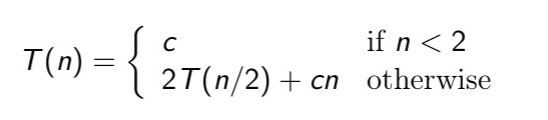

An algorithm is a sequence of steps for performing a task in a finate amount of time.

#### Big-Oh Notation
Given two positive functions *f(n)* and *g(n)*, **f(n) is O(g(n))**, written as `f(n) ∈ O(g(n))`, with constants *c* and *a0*: `f(n) <= c*g(n) for all n >= n0`
- Any polynomial `akn^k + ... + a2n^2 + a1n + a0` with **ak > 0** is `O(n^k)`, also `O(n^j)` for all **j >= k**
Common functions:
- *Logarithmic* O(log n)
- *Linear* O(n)
- *Quadratic* O(n^2)
- *Polynomial* O(n^k) for a positive integer k
- *Exponential* O(a^n), a > 1

g(n) is O(f(n)) and f(n) is O(g(n))

#### Justification Techniques
- *Methemetical induction*
- *Contradiction*: Suppose the proposition is not true
- *Contrapositive argument*: p => q is equivalent to ¬q => ¬p
- *Counterexample* (disproof)

### Heap Data Structure
The elements and their keys are stored in an almost complete binary tree (most of times), every level of the binary tree (expect last), will have the maximum number of children possible.
- *Heap-order* property: In a heap T, for every node v, the key at v is less than(equal) the key stored at its parent

#### Root deletion
1. swap root with last element
2. delete last element
3. bubble root (last) down

## Divide-and-Conquer
- Merge sort: `O(nlogn)`, dividing/merging is `O(n)`, recursive at most `O(log n)`
- Incremental algorithm
- *Divide*: If the input size is small then solve the problem directly; otherwise, divide the input data into two or more subsets, typically disjoint
- *Recur.*: Recursively solve the sub-problems associated with subsets
- *Conquer*: Take the solutions to sub-problems and merge into a solution to the original problem

- *recurrence relation*: `T(n)`, the worst-possible running time on an input of size **n**, relates T(n) to values of function T for problem sizes smaller than n



```
T(n) = 2^j T(n/2^j) + jcn
for j = log n
T(n) = 2^(log n)c + cn log n = Θ(n log n)
```

### Matrix Multiplication

### Rooted trees
sortable, still efficient for search, insert/delete
- binary tree

### Merge Sort / Heap Sort
- O(n log n )