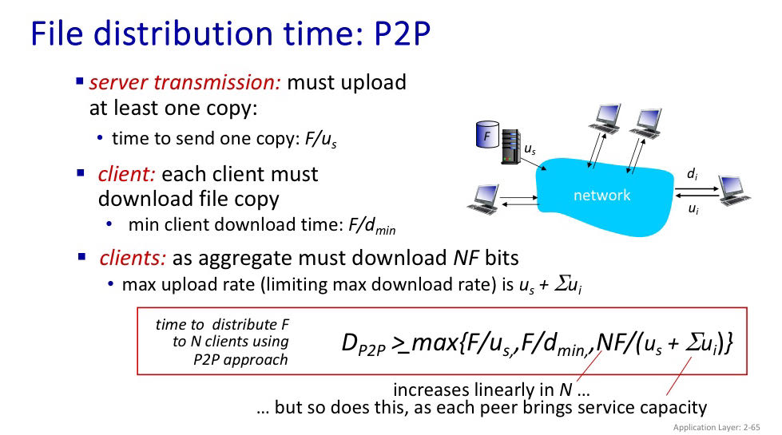

# 09/28/2023
- ISP: Internet Services Provider
- **packet switching**: break application-layer messages into packets
- L bits per packet, R bps. Tranmission delay: L/R seconds
- queueing delay
- Store and forward: entire packet must arrive at router before it ca be transmitted on next link
- routing algorithm: RAP
- FDM (Frequency Division Multiplexing) and TDM (Time Division Multiplexing)
- Network of Networks

# 10/02/2023
#### Application layer
- P2P: distributes the host to peers (customers computer)
	- client & server processes
- Inter-process communicating
	- client: process that initiates communication
	- server: process that waits to be contacted
- Sockets: process sends/recieves messages to/from
- Addressing: IP & port number
	- IP: 32-bit, each host has a unique one, could mirror the host name
	- Port: a number between 0-65535, corresponding a listener process on the host.
- A application layer protocal defines:
	- type of messages exchanged
	- message syntax, semantics
	- rules for how processes send and respond to messages.
- A app need: data integrity, timing, throughput, security
- TCP service:
	- reliable transport
	- flow control
	- congestion control
	- does not provide: timing, troughput, security guarantee
	- connection oriented
- UDP service:
	- unreliable transport
	- does not provide everything
- TLS&SSL:socket protocal for TCP, encripted connections, end-point authentication, data integrity
- Non-persistant response time: 2RTT + file transmission time
	- RTT:  a small packet to travel from client to server and back.

# 10/05/2023
### HTTP
- HTTP message: request, response

#### Request
- request line, request header, empty line, request entity
- GET: user input transferred in URL field, by following `?`
- POST: sent in entity body of HTTP package
- HEAD: request headers only
- PUT: uploads new file to server

#### Response
- response status code
	- *200 OK*
	- *301 Moved Permanently*
	- *400 Bad Request*: request not understood
	- *404 Not Found*: resources request not found on the server
	- *505 HTTP Version Not Supported*

#### Cookie
- HTTP is a stage-less protocol
- Cookie: maintaining user/server state
- Generate a unique id, entry in backend database for ID
- Every time client send request to the server with the ID, the server could
- recognise and given special services.
- Session state

#### Web caches
- satisfy client request without involving origin server
- Proxy server the request messages to the origin server, if the resource exists in proxy server, then response it directly with not requesting the origin server.
- Weaken the transferring delay if the proxy server in nearer to the client.
- CDN

### SMTP: E-mail
- User agents
- Mail servers
- Sample mail transfer protocol: SMTP \[RFC 5321\] \[RFC 822\]
- Uses TCP
- HTTP: pull, each object encapsulated in tis own response message
- SMTP: push, multiple objects sent in multipart messages persistent connections, uses CRLF to determine end of message
- Status code: 
	- 220: STMP Service ready
	- 221: Service closing
	- 250: Requested action taken and completed
	- 354: Start message input and end with `.`
	- 421: The servece is not available and the connection will be closed
	- 450: The requested command failed because the user's mailbax was unavailable (such as locked) try again later.
		- verify teh email account; check mail server's blacklist

# 10/06/2023
#### DNS
- The Domain Name System \[RFC 2136\]
- Translate the IP address with the host name
- host, mail server aliasing
- load distribution
- important in internet function
- Top-Level Domain (TLD) servers: .com, .org, .net…
- Authoritative DNNS servers providing authoritative host name to IP mappings for organization’s named hosts
- Query the host name mapping through hierarchy
- Resource records(RR): A, NS, CNAME, MX

#### P2P applications
- no always-on server
- Peers communicate with each other directly

- BitTorrent: requesting, sending file chunks (tit-for-tat )

# 10/10/2023
### Socket programming
Socket: door between application process and end-end-transport protocol
#### UDP
- unreliable data gram: no “connection” between client&server, which may be lost or received out-of-order
- Application: UDP provides **unreliable** transfer of groups of bytes (datagrams) between client and server
- `DatagramSocket()`, `DatagramPacket()`

#### TCP
- client must contact server by TCP socket, specifying IP address, port number of server process. Once client creates socket, client TCP establishes and connection to server TCP
- Application TCP provides **reliable, in-order type-stream** transfer(pipe) between client and server
- `Socket()`, `DataOutputStream()`

# 10/12/2023
### Transport layer
- logical communication between application processes running on different hosts
- Network layer: logical communication between hosts
- processes the header value beyond the application layer package
- segment
- Transmission Control Protocol
	- reliable in-order delivery
- User Datagram Protocol
	- unreliable

# 10/13/2023
- TCP: demultiplexing 
- `DatagramSocket(<local—host-port>)`
- same IP address and destport 80, are demultiplexed to different sockets
- UDP: no handshakes, connectless, no congestion control, small header

# 10/16/2023
- rdt1.0: reliable transfer over a reliable channel
```sender
rdt_send(data)
packet = make_pkt(data)
udt_send(packet)
```
```receiver
rdt_rcv(packet)
extract(packet, data)
deliver_data(data)
```
- 2.0: channel bit error
	- acknowledgements & negative acknowledgements
	- sender sends one packet, then waits for receiver response
- 2.1: FSM specifications
- 2.1: sender, handling garbled acts
- 2.2: nak-free protocol
- 3.0: channels with errors and lost, timeout figured

# 10/19/2023
- rdt3.0: stop and wait operation
- pipelining
- Round Trip Time
- Selective repeat 

# 10/23/2023
#### Congestion control
- inferred from observed loss
- routers feedback directly to sending/receiving hosts with flows passing through congested router
- Additive Increase, Multiplicative Decrease
- slow start: 
	- `ssthresh`: on loss event, ssthresh is set to 1/2 of cwnd jest before loss event
	- `cwnd`: 1 MSS initially, double every RTT, switch to linear increase when achieve `ssthresh`
- QUIC: Quick UDP Internet Connections
	- app-layer protocol, on top of udp
	- increase performance, deployed on many google servers and apps
	- error and congestion control: a algorithms parallel TCP ones
	- connection establishment: reliability, congestion control, authentication, encryption, state established in one RTT
	- one handshake: reliability, congestion control, authentication, crypto state

# 10/26/2023
### Network Layer
- transport segment from sending to receiving host
- network layer protocols in every Internet device :hosts, routers
- routers: examines header fields in all IP data grams passing through it
- functions:
	- **forwarding**: move packets from a router’s input link to appropriate rout output link
	- **routing**: determine route taken by packets form source to destination, by algorithms
- **Data plane**: local, per-router function
- **Control plane**: network-wide logic, how datagram routed along end-end path
	- *traditional routing alogrithms*
	- *software-defined networking (SDN)*

#### Router
- *routing, management control plane* (software): millisecond
	- routing processor
- high-speed switching fabric
- *forwarding data plane* (hardware): in nanosecond
	- line termination (physical layer)
	- link layer protocol
	- lookup, forwarding queueing: using header field values, using forwarding table in input port memory (match plus action)
		- *destination-based forwarding*: only on destination IP address
		- *generalized forwarding*: any set of header field values
- destination-based forwarding
- longest prefix matching

### IP datagram & fragmentation
- options: timestamp, record route taken
- overhead: 40 bytes + app layer overhead for TCP+IP
	- 20 bytes of TCP
	- 20 bytes of IP
- MTU: max. transfer size

# 10/30/2023
### IP addressing
- IP address: 32-bit identifier associated with each host or router interface
- *interface*: connection between host/router and physical link
- *CIDR*: Classes InterDomain Routing: slash
- Where to get: hard-corded by sysadmin in config file / DHCP
- *DHCP*: Dynamic Host Configuration Protocol
	- broadcasts DHCP discover msg
	- response DHCP offer msg
	- DHCP request from hosts
	- DHCP ack, send address
- *NAT*: network address translation: defines in local network share 1 IPv4 address, mirror sub-net address to the port number
- *IPv6*: 128-bits
	- 40-byte fixed length header
	- flows treatment
![[9b0f489416fd9b94f26efb80f82733b.jpg]]
- *tunneling*: IPv6 datagram carried as payload in IPv4 datagram among IPv4 routers (packet within a packet)

# 11/02/2023
### Generalized Forwarding, SDN
- *Flow table* abstraction: define router’s match+action rules
- *flow*: defined by header field values (link-, network-, transport-layer fields)
- *generalized forwarding*: 
	- match: pattern values in packet header fields
	- actions: for matched packet: drop, forward, modify, send to controller
	- priority: disambiguate overlapping patterns
	- counters: #bytes and #packets
- Router
	- match: longest destination IP
	- forward
- Switch
	- destination MAC address
	- forward or flood
- Firewall
	- IP address and TCP/UDP port number
	- permit or deny
- NAT
	- IP address and port
	- rewrite address and port

## Network Layer: Control Plane
Control plane: routing: determine route taken by packets from source to destination
- per-router control (traditional): individual routing algorithm components in each and every router, interact in the control plane
- logically centralized control (software defined networking): remote controller computes, installs forwarding tables in routers

### Routing Algorithms
Determine good paths (equivalently routes)
- path: sequence of routers packets traverse from given initial source host to final destination host
- good: least cost, fastest, least congested

# 11/03/2023
#### Intra-AS Routing in the Internet: OSPF
- inter-AS: gateways 
	- RIP: Routing Information Protocol
	- EIGRP: Enhanced Interior Gateway Routing Protocol
	- OSFP: Open Shortest Path First \[RFC 2328\], *IS-IS* is a same protocol from ISO
	- BGP: Border Gateway Protocol: glue that holds the Internet together
		- eBGP
		- iBGP
- intra-AS: same AS must run same intro-AS protocol, *gateway router* at edge of its own AS, link to other ASs

# 11/07/2023
- Software-Defined Networking: logically centralized
- controller (network os)
## Link Layer
- broatcast channel shearing
- local area networks: etheret, wlan
- error detection, correction
- transferring datagram from the node to physically adjacent node over a link , using different lik protocol
- frame, encapsulates datagram(network layer)
- implemented in netork interface card（NIC）， combination of software， hardwre and firmware 

# 11/09/2023
### Error detection, correction
- EDC: error detection and correction bits
- D: data protected, may include header fields
- two-dimensional bit parity
- *Cyclic Redundancy Check (CRC)*
- D: data bits as binary number
- G: bit pattern, of r+1 , predefined
- `r`CRC bits, R, `<D,R>` exactly divisible by G (mod 2)
- complete the divide number for polynomial G to no remainder

### Multiple access protocols 
- point-to-point
- broadcast
- *MAC protocols*
- ALOHA
- CSMA (carrier sense multiple access)

# 11/10/2023
#### CSMA/CD
- carrier sense multiple access with collision detection
	- channel idle: transmit entire frame
	- channel busy: defer
- “Taking turns” MAC protocols

# 11/13/2023
#### Ethernet
- dominant wired LAN technology
- *switched*: active link-layer switch in center
- frame structure:
	- preamble
	- addresses: 6 byte, dest. MAC address
	- type: indicates hire layer protocol
	- CRC: cyclic redundancy check at receiver
- connectionless
- unreliable
- Ethernet standards: copper physical layer

#### Wireless and Mobile Networks
- wireless
- mobility: handling the mobile user who changes point of attachment to network

# 17/11/2023
## Physical Layer
### Time domain concepts
- Analog signal: varies in a smooth way over time
- Digital signal: Maintains a constant level then changes to another constant level
- Periodic signal: Pattern repeated over time
- A periodic signal: Pattern not repeated over time
- `s(t) = A * sin(2πft + Φ)`

- data, signals and transmission

- B: bandwidth
- M: number of signal states
- S/N: signal-to-noise ratio
Noise free channel (Nyquist): `Max data rate = 2 * B * log[base2] M`
Shannon’s law: `Max data rate = B * log[base2] (1 + S/N)`

# 11/23/2023
## Network Security
- eavesdrop
- impersonation
- man-in-the-middle attacks
- hijacking
- denial of servicce

- *confidentiality*: only sender, intended receiver should understand message contents
- *authentication*: sender and receiver confirm identity of each other
- *message integrity*: sender, receiver ensure message not altered without detection
- *access and availability*: services must be accessible and available to users

### Cryptography
#### Symmetric key cryptography
- Monoalphabetic encryption
	- Caesar
- Polyalphabetic encryption
	- Block ciphers: 2^k! mappings
![[c28a299f31f7d5a7323ce36158b2a1f.jpg]]

![[b05cc94894e188baaced867f918d43d.jpg]]

# 11/30/2023
#### Public Key Cryptography
##### RSA
```
1. choose two large prime numbers p, q. (e.g., 1024 bits each)
2. compute n = pq, z = (p-1)(q-1)
3. choose e (with e<n) that has no common factors with z
	(e, z are “relatively prime”)
4. choose d such that ed-1 is exactly divisible by z
	(in other words: ed mod z = 1 )
5. public key is (n,e). private key is (n,d)

c^d mod n = m    m^e mod n = c
m = (m^e mod n)^d mod n
```

for any x and y: `x^y mod n` = `x^(y mod z) mod n`
where n = pq and z = (p-1)(q-1)
thus
```
c^d mod n = (m^e mod n)^d mod n
= m^ed mod n
= m^(ed mod z) mod n
= m^1 mod n
= m
```

**property: the sequence of using public/private key is doesnt matters**
```
(m^e mod n)^d mod n = m^ed mod n
= m^de mod n
= (m^d mod n)^e mod n
```

### Authentication
host A wants to prove identity of B
- nonce: number `R` used only once in a lifetime
- *ap4.0*: to prove B is live, A sends B a nonce `R`, B must return R, encrypted with shared symmetric secret key
- *ap5.0*: use nonce, public key cryptography

### Integrity
#### Digital signatures
for a large message `m`, sender digitally signs document: owner/creater 
1. use a *hash function* `H` compute hash value `H(m)`
2. encrypting with his *private key* `KB-(H(m))`
3. send the **origin message and encrypted msg** digest
	- `(m, KB-(H(m)))`
	- *verifiable*, *nonforgeable*
recipient varifies signature, integrity of digitally signed message
1. using the origin message`m`, compute hash value by the **same hash function** ==> `H(m)`
2. decrypt the encrypted msg digest`KB-(H(m))` by *sender's public key* ==> `H(m)`
3. compare two hash value, both for integrity and varification

#### Hash function algorithms
- MD5 (RFC 1321): 128-bit msg digest string
- SHA-1 (NIST, FIPS PUB 180-1): 160-bit msg digest

#### Public key Certification Authorities (CA)
- binds public key to *particular entity*, `E`
- eneity (person, website, router) registers its public key with `CE`, privedes "proof of identity" to CA
- creates certificate to binding E and E's public key, digitally signed by CA
	- `KCA-(KE+)`

### Security in Internet protocol stack
#### Email
![[Pasted image 20240119023855.png]]

#### Transport-layer security (TLS)
deployed mostly above the transport layer: HTTPS (443)
- *confidentiality*: symmetric encryption
- *integrity*: crtptographic hashing
- *authentication*: public key cryptography
History: SSL/TLS (RFC 8846)

#### WIFI security: 802.11 authentication, encryption
1. discovery of security capabilities
2. mutual authenticaiton and shared symmetric key derivation
3. shared symmetric session key distribution
4. encrypted communication between mobile and remote host via AP