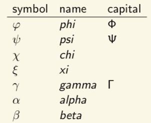
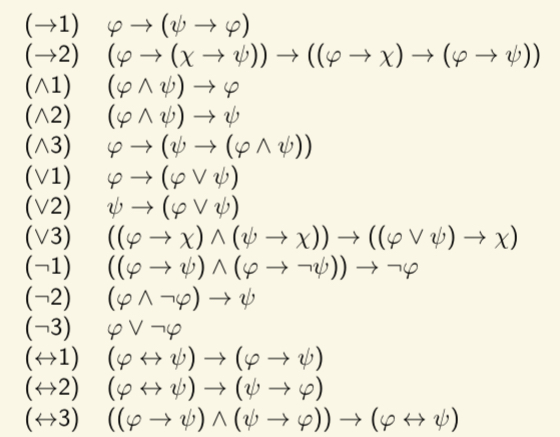

## Logic
Any Logic comes in three parts
- a language, that defined the *well-formed formulas (wffs)*
- semantics, that five meaning to formulas
- a deduction system, that allows us to find valid (guaranteed to be true) formulas

## Reminder Propositional Logic (PL)
- Formal system to precisely describe reasoning
- almost all symbolic reasoning
- uncontroversial & limited in applicability

### Language
Set P of atoms, P = p, q, p1, p2, ...
- represent *basic facts* that we dont analyze further

*Well-formed formulas (wff)*
- Every p ∈ P is a wff
- If A and B are wffs, then (A § B) or (§a) are wffs
- Nothing else if a wff (propositional)

Use brackets if this do cause ambiguity
- negation binds stronger than other connectives

#### Greeks


#### Pronunciation
- `¬` negation, usually pronounced: "not"
- `∧` conjunction, "and"
- `∨` disjunction, "or"
- `→` imnplicatoin, "implies" or "if... then.."
- `↔` bi-implicatoin, "if and only if" (异或xor)

### Semantics
Exact meaning of connectives is determined by the *semantics*: *Truth tables*

Truth or falsity of a propositional formula depends on the truth/falsity of the atoms in the formula.

#### Valid formulas
The formulas that are always true
Notation: 
- `|= φ` (valid)
- `|=/`(non-validity)

#### Valid Inference
If (i) p is true and (ii) q is true, then `p ∧ q` is guaranteed to be true as well.
- `{p, q} |=  p ∧ q` where `p` and `q` are the *premises*, `p ∧ q` is the conclusion.
- `Γ |= φ` if the set of *premises* `Γ` guarantee the truth of the conclusion `φ`
- `φ` is valid if the inference from `∅` to `φ` is valid, So `|= φ` if and only if `∅ |= φ`

##### Semantical Valid Inferences
Check whether every row that makes all premises true makes thet conclusion true
- *Counterexamples*: row in a truth table where premises true, conclusion false, exists when an inference is not valid

##### Syntactically Valid Inferences
Use a formal proof system, with *premises* and *axioms*, derive new valid inferences using an inference rule

#### Derivation
Notation: Γ ⊢P φ if φ can be derived Γ in P
Rule (MP): if you have derived φ and φ → ψ, derive ψ.


A proof system is only considered useful if it is *sound* and *complete*
- Soundness: If Γ ⊢P φ, then Γ |= φ. So we can only derive valid inferences
- Completeness: If Γ |= φ, then Γ ⊢P φ. So every valid inference can be derived

#### Abbreviations
`⊤` something that is always true
`⊥` something that is always false

#### Abbreviation
- φ ∧ ψ can abbreviate ¬(¬φ ∨ ¬ψ)
- φ → ψ can abbreviate ¬φ ∨ ψ
- φ ↔ ψ can abbreviate (φ → ψ) ∧ (ψ → φ)

So propositional logic can be defined as: `φ ::= p | ¬φ | φ ∨ φ`

## Modal Logic (ML)
- Extension of propositional logic -> *modalities*
- also concerned when, where, to which extent and how something is true
- the basis for EL and DL

Language of modal logic: `φ ::= p | ¬φ | φ ∨ φ | □φ  `
- Also `♢φ` abbreviation for `¬□¬φ`

- Alethic □φ means: “φ is necessarily true.”
- Epistemic □φ means: “I know that φ is true.”
- Doxastic □φ means: “I believe that φ is true.”
- Temporal □φ means: “At every time in the future, φ will be true.”
- Deontic □φ means: “φ should be true.”
- Legal □φ means: “φ is legally required to be true.”

- Alethic ♢φ means: “φ is possibly true.”
- Epistemic ♢φ means: “as far as I know, φ might be true.”
- Doxastic ♢φ means: “I believe that φ might be true.”
- Temporal ♢φ means: “At some time in the future, φ will be true.”
- Deontic ♢φ means: “φ is allowed to be true.”
- Legal ♢φ means: “it is legal for φ to be true.”

- Temporal: □♢p.
At every point in the future, p will be true some later time.
- Deontic: □p → ♢p.
If p is mandatory then it is also permitted.
- Legal: ¬♢□¬p.
It is not permitted to forbid p.
- Epistemic: □p → □□p.
If I know p, then I know that I know p.


## Epidemic Logic (EL)


## Description Logic (DL)
Used to describe *ontologies*
- a formal naming and definition of the types, properties, and interrelationships of the entities, for a particular domain of discourse.
- to determine which objects satisfy a concept

### Language of ALC
*Attribute Logic with Complement*: multi-agent modal logic -- except with different symbols


- *Object names*: describes a single object, no objects has multiple names.
	- There can be objects without name
- *Atomic concept*: a single word that describes a number of objects
- *Concepts (relation symbols)*: combine one or more atomic concepts into a more complex description.
- Formulas of ALC are called *concepts* and given by

```
X ::= ⊤ | ⊥ | A | ¬X | X ⊔ X | X ⊓ X | ∀r.X | ∃r.X
```
where A ∈ C and r ∈ R
- `∃r.X`: object that stand in the relation `r` to **some object** that is `X`
	- at least one   对于所有...存在...
	- Modal logic: `♢r φ`
- `∀r.X`: objects that only stand in the relation `r` to **objects** that are `X`
	- if any, are all   对于所有...都满足...
	- Modal logic: `□r φ`
- `⊤`: indicates **any object**: `p ∨ ¬p`
	- `∃hasChild.⊤` is someone who has at least one child
- `⊥`: indicates **no object**: `p ∧ ¬p`
	- `∀hasChild.⊥` is someone who only has “nothing” as children (has no children)

### Semantics of ALC
Refer to models as *interpretation*

- `∆` as things that actually exist, acts as the set of worlds in drawing
- The map `·I` tell us who has which name

### TBox
`X ⊑ Y`: the X are a subset of the Y
`X ≡ Y`: the X are exactly the same as the Y

Taxonomy: a categorization of concepts
TBox: finite set of *subsumptions*, represents a taxonomy
TBox may only contain subsumptions where the left-hand side is an atomic concepts, i.e. subsumptions `A ⊑ X` or `A ≡ X`

```
parent ≡ person ⊓ ∃hasChild.⊤
mother ≡ parent ⊓ female
grandparent ≡ person ⊓ ∃hasChild.parent
```

### ABox
#### Concept Assertions
"the object with name `o` satisfies concept X": 描述单个个体属于某个概念
Notation: `o` : `X`

```
Ann : parent
Fido : canis ⊓ ¬person
```

#### Role Assertions
"the object with names `o1` and `o2` stand in relation `r` to each other": 描述两个个体之间的关系
Notation `(o1, o2)` : `r`

```
(Ann, Claire) : hasChild
"the object named Ann is in the relation hasChild with the object named Claire" ==> "Claire is the child of Ann"
```

ABox: finite set of **concept and role assertions**

*Knowledge base*: ABox + TBox
- `K = (A, T)`

### Checking
#### Consistency
A knowledge base `K` is *inconsistent* if it is impossible to satisfy
So `K` is inconsistency if for every `I`, we have `I not|= K`

- TBox: Possible for a TBox to be inconsistent by itself, i.e. for (∅, T ) to be inconsistent, statements cannot be satisfied at the same time
- ABox: Possible for a ABox to be inconsistent by it self, i.e. for (A, ∅) to be inconsistent.

*Coherence* and *Entailment* are related to consistency
1. `X` is coherent w.r.t.(with respect to) `K` iff (`A∪{o:X}, T`) is consistent
	- `X` 在知识库(由断言 `A` 和公理 `T` 组成）中是连贯的, 当且仅当将 `X` 添加到 `A` 后仍然一致 (`o`是一个新引入的符号)
2. `K |= o : X` iff `(A ∪ {o:¬X}, T)` is **inconsistent**
	- 知识库`K`蕴含`o : X`当且仅当, 将`¬X`添加到断言集后, 知识库`K`变得不一致
	- 假设 K 中已经包含 Bird⊑Animal，如果尝试加入 ¬(Bird⊑Animal)，会导致矛盾，因此可以说 K⊨o:(Bird⊑Animal)
3. `K |= X ⊑ Y` iff `(A ∪ {o:X, o:¬Y}, T)` is inconsistent, where o does not occur in A
	- 知识库`K`蕴含`X ⊑ Y`当且仅当, 将`X` 和 `¬Y`同时添加到断言集中会导致不一致 ==> "如果 X 成立，而 Y 不成立，那么这与知识库矛盾，因此可以得出 X⊑Y"

#### Coherence
```
parent ≡ person ⊓ ∃hasChild.⊤
grandparent ≡ person ⊓ ∃hasChild.parent
```

#### Entailment
An *assertion* `o : X` is entailed by `K` if every interpretation satisfying `K` also satisfies `o : X`
- `K |= o : X`

A *subsumption* `X ⊑ Y` is entailed by `K` if every interpretation satisfying `K` also satisfies `X ⊑ Y` (similarly as `X ≡ Y`)
- `K |= X ⊑ Y`

Only concept assertions can be entailed

#### Tableaux based method
works only for *acyclic* knowledge (非循环知识库) bases

A atomic concept `A` *dierctly uses* an atomic concept `B` if where is a subsumption `A ⊑ X` or `A ≡ X` in `T` such that `B` occurs in `X`, 显式直接使用

A atomic concept `A` *uses* an atomic concept `B` if where is a finite sequence `A1, · · · , An` of atomic cencepts such that `A` directly uses `A1`, `A1` directly uses `A2`, ..., `An` directly uses `B`, 间接关联使用

##### Cycles
A knowledge base `K` contains a *terminological cycle* if where is a concept that **uses** it self

A knowledge base `K` is *acyclic* if
- `K` contains no terminological cycle
- every atomic concept occurs on the left-hand side of at most one subsumption in `T` (不允许重复定义同一个概念)

层级调用和相互调用

##### 6 Steps of Tableaux
Let `K = (A, T)` be an acyclic knowledge base. Consistency of `K` is checked in 6 steps
1. Eliminate ⊑ from the TBox
	- Add a **new atomic concept** `A*` that caracterizes those `X` that are `A`, distinguishes whose X that are A from those X that are ¬A
	- `A ≡ X ⊓ A∗`
	- Then replace every `B ⊑ Y` by `B ≡ Y ⊓ B∗`
	- Resulting knowledge base: `K*`
2. Expand the TBox
	- If `A ≡ X` is in `T∗`, then every occurrence of `A` in other concept definitions can be replaced by `X`, replacing until no further replacements are possible
	- Resulting TBox: $T^{∗e}$
3. Eliminate *defined concepts* from the ABox
	- When `o : A` is in `A`, and `A ≡ X` is in $T^{∗e}$
	- Then replace `o : A` by `o : X`
	- ABox的名字映射直接简化与subsumption的右手对应
4. Put the ABox in **negation** normal form
	- put the ABox $A^e$ in *Negation Normal Form (NNF)*
	- Resulting ABox $A^{en}$
	
5. Apply *completion rules* to the ABox
	- Build a *tree* of sets of concept and role assertions, the *root* of the tree is $A^{en}$
	- Whenever one of the folloowing rules can be applied to any node $\Gamma$, use then to generate new nodes.
	
	1. 交集规则: o同时属于X和Y, 补全声明
	2. 并集规则: o属于X或Y, 补全单独的声明
	3. 存在性规则: o1**存在**Role assertion但没有任何o2符合, 添加o3声明和相应的断言
	4. 全称规则: 全称限制: o1和o2通过r关联那么o2必须属于X, o2不存在则添加声明o2属于X
	5. o同时包含逻辑冲突, 添加`o:⊥`表示o属于不可能的概念, 逻辑冲突
6. Check the leaves for contradictions
	- A set $\Gamma$ contains an *immediate contradiction* if `o:⊥∈Γ` for some o
	- If no more rules can be applied: chack the leaves
	- If all endpoints contain immediate contradictions: `K` is inconcsistent
	- If *at least one* endpoint contains no *immediate contradiction:* `K` is consistent 

### Complexity
#### Language EL
$$X\space::=\space\top\space|\space A\space|\space X\space\sqcap\space X\space|\space\exists r.X$$
Destroy `⊔` and `∀`
- `X ⊔ Y` is equivalent to `¬(¬X ⊓ ¬Y)`
- `∀r.X` is equivalent to `¬∃r.¬X`
- `¬` and `⊥`

Define things by properties they have, not by properties they lack


- Counting
- Inverse
- Transitive Closure