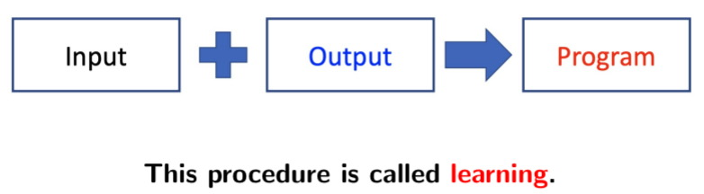

- Biomolecular Computation
- Computational Biology
- Bioinformatics
- Biological Computation



*Biological Excitability*: The membrane potential may change in response to electrical perturbation from other neurons. If the perturbation is sufficiently large, above a **threshold** in **intensity and duration**, the response is a large amplitude electrcal wave propagation from teh stimulated points to the rest of the tissue.

The *excitation* and *transmission* are **all-or-none** and do not allow varying degree of strength

## MP Neuron
McCulloch-Pitts Neuron (1943)
- a **binary**, **discrete-time** input
- with *excitatory* and *inhibitory* connections and an *excitation threshold*


- A neuron `j` with n+1 inputs
- Each inputs `i` transmits a real value $\color{yellow}a_i$
- Each connections is assigned with the *weight* $\color{yellow}w_{ji}$
	- $w_i$ = **+1** for *excitatory* type connection
	- $w_i$ = **-1** for *inhibitory* type connection
- The *total inputs S* (the sum of the products of the inputs with the corresponding weights), is compaired with the *threshold 𝜃*, and the **outcome** $\color{yellow}X_j$ is produced consequently

$X^t = 1$ if and only if $\color{red}S^{t-1} = \sum_i w_i a_i^{t-1} \ge \theta$, and $\color{cyan}w_i > 0,\space \forall a_i^{t-1} > 0$

#### Activation function
*threshold activation function (example)*


### Simple logical functions
The output 1 and 0 can be associated with the locigal value true/false
- AND, OR, NOT
Can only be used to represent some boolean functions which are *linearly separable*
- 存在一条直线（平面），函数产出的所有1都在一侧，产出的0都在另一侧

Another important function of the brain: to acquire new knowledge through experience, i.e. learning

## ANN Learning rules
Do not check the inhibitory input
ANN learning rule is the rule how to adjust the weights of connections to get desirable output
- storing information
- producing logical and arithmetical operations on it
### Hebb's Rules
"Cells that fire together, wire together"

- t + 1: next instant
- C: learning rate: positive coefficient

Input is not eaqul to 0 => Excitatory input
Output is not eaqual to 0 => Neuron is fired


### Oja's Ruls
Normalized Hebb's rule
By normalization, the weights will not monotonously increase, but converge after, which reflects the predisposition to different inputs. It plays an important role in *unsupervised learning* or *self-organisation*.


*unsupervised learning*: We care which inputs are considered similar by the network, rather than the meaning of the output pattern
- the algorithm is not provided with any pre-assigned labels or scores for the training data
- first **self-discover any naturally occurring patterns** in that training data set

### Kohonen Rule
Competitive learning (multiple outputs): only a single output neuron is updated at any instant


*winner*: one of the output neurons, has maximim value (**j-th**) of the instant state $\color{yellow}S_j$ at that instant, and only the weights of the winner's connections $$w_j=(w_{j1},w_{j2},...,w_{jn})$$
is updated


- Difference between input `a` and weight `w`

## Perceptron
A neuron network that changes with "experience" using an error-correction rule.

Weight of a neuron changes when it makes **error response** to the input presented to the network


- One layer of inputs
- One layer of outputs
The two layers are fully interconnected.

Semantically, a *perceptron* can be considered as a vector-valued function that maps the input `a = {a0, a1,..., an}` to the output `X = {X1, X2, ..., Xm}`, allows **real inputs**
 
Each output neuron has the same inputs, which the total input layer, while each individual outputs are with **individual connections** and therefore have **different weights** of connections

### Perceptron Training
The *weighted input* to the j-th output neuron
$$S_{j} = w_{j0} a_{0} + \sum_{i=1}^{n} w_{ji} a_{i}$$
- $\color{aqua}{a_{0}}$ is a special input neuron with **fixed** input value of +1
- $\color{aqua}{w_{j0}}$ rename as $\color{aqua}{-\theta_{j}}$
$$S_{j} = -\theta_{j} + \sum_{i=1}^{n} w_{ji} a_{i}$$
Thus, no need to set threshold manually, threshold train like weights

The value $X_{j}$ depends on whether the weighted input in greater than 0

`f`: *activation function*
Predict the "desired output" ==> *perceptron "learning" or "training"*

The perceptron is trained by using a *training set* with *target outputs (labels)*
- 多样本训练集:  a set of input pattern **repeatedly (multiple times)** presented to the network during training
	- Input pattern in the set is **n-dimensional**. `a0 = 1`
- 目标输出 (标签): pre-defined correct output of an input pattern in the training set. 标签是supervised learning的标志

The output neuron first compute an output `Xj`
then compared to the desired outputs specified in the trainingg set and abtain the *error* ==> the difference between the target output and the instant one.


The **goal of the training** is to arrive at a singleset of wights that allow each input in the training set to be mapped to the correct output by the network.

### Weight Update
1. Compute "error" of every connection for every ouput neuron
$$e_{j}^{k} = \{t_{j}^{k} - X_{j}^{k}\}$$
2. Update the weights:
$$w_{ji}^{k} = w_{ji}^{k} + \Delta w_{ji}^{k}$$
	where *Perceptron Learning Rule*
$$\Delta w_{ji}^{k} = Ce_{j}^{k}a_{i}^{k}$$
	A weight changes iff both the *input value* and the *error of the output* are **not** equal to 0
	
	The *"learning rate"* `C` is usually below 1 and determines the amout of correction made in a **single iteration**
	
	The **overall learning time of the network** is affected by the value of the "learning rate" C: *slower for small values* and *faster for larger*

3. When RMS is closed to zero, stop the training
	
	The network performance during training session is measured by root-mean-square error value
	
	The **first sum** is overall patterns; the **second sum** is all output neurons
	
	Once t, r, m and a are constants, $X_{j}^{k}$ is the only variation in the RMS function only, and the weights $w_{ji}^{k}$ is the only variation of X
	$$X_{j}^{k} = f(\sum_{i=0}^{n}w_{ji}^{k}a_{i}^{k}) = \overline f_{a}\tiny k(w_{ji}^{k})$$
	Thus, RMS error: `RMS` = $F_{D}(w)$, where `w` is network weight, `D` is data set
	
	The **best performance of the network** over a given data set `D` corresponds to the minimum of the `RMS error`, and we adjust the weight of connections `w` in order to reach the minimum
	
	The initially weights are all set to **small random values**, the error close to zero during training, the network has **converged**

### Convergence
The perceptron learning algorithm can converge for the data set that is *linearly separable*

*Linearly separable*: Two sets `P` and `N` of points is an n-dimensional space are called (absolutely) linerly separable if there exists a real vector `w = (w1,...,wn)` such that every point `a' = (a1,...,an)∈P` satisfies $w^{T}a'>0$ and every point `a' = (a1,...,an)∈N` satisfies $w^{T}a'<0$

Assume the data set `D` is (absolutely) linearly separable, then set $D'=\{[1,a']\space|\space a'\in D\}$ is also (absolutely) linearly separable

The data set $D'=\{[1,a']\space|\space a'\in D\}$ can be divided into two separated set `P` and `N`, by the definition of absolutely linear separability

## Multilayer Perceptron

- All the neurons are divided into `l` subsets, each set is called alayer
- adjacent layers are **fully connected**
- each connection is associated with a *real weight*
- each neuron is associated with a *real bias* (assumed 0)
- inputs and outputs are all **real**

### Forward Propagation
The *first hidden layer*, the output of the j-th neuron in the first layer
$$X_{j}^{1} = f_{j}^{1}(S_{j}^{1})=f_{j}^{1}(\sum_{i=0}^{n^{0}}w_{ji}^{1}X_{j}^{0}+b_{j}^{1})=F_{j}^{1}(w_{j}^{1},X^{0}),j=1,...,n^{1}$$
Thus, *output of layer1* is the *output of layer0* combined with *weight layer1*$$X^{1} = F^{1}(w^{1},X^{0})$$
Can be derived for the following layers, called *forward propagation*

### Gradient Descent
Define the *performance of multilayer perceptron* over a dataset `D` as a half of the total squared error (`r`: data set number; `m`: output neurons), 1/2: simplified coefficient of gradient
$$E = \sum_{k=1}^{r}E^{k} = \frac 12\sum_{k=1}^{r}\sum_{j=1}^{m}(e_{j}^{k})^{2} = \frac 12\sum_{k=1}^{r}\sum_{j=1}^{m}(t_{j}^{k}-X_{j}^{k})^{2}$$
Substitute with the k-th input pattern $a^{k}$, and j-th neuron output layer $F_{j}$: $$=\frac 12\sum_{k=1}^{r}\sum_{j=1}^{m}(t_{j}^{k}-F_{j}(w^{l}, w^{l-1}, ..., w^{1}, a^{k}))^{2} = E(W)$$
Therefore, the *MLP error function* `E` is a function of the weights of connections only

The better the MLP performs, the smaller the MLP error function `E` is
The optimization problem: $min_{w}E(w)$, which the ***Gradient Descent***, addresses the issuue of how to update weights

#### Error Backpropagation Algorithm
One of the most popular techniques, it looks for the minimum of the error function `E` in the space of weights of connections `w` using the method of gradient descent


$\frac {\partial E}{\partial w_{ji}^{h}}$: partial derivative of the error function `E` w.r.t. the weight of connection between `j-th` neuron in the layer `h` and `i-th` neuron in the previous layer `h-1`

***Update rule*** including the hidden layer (`C`: learning rate):
$$w_{ji}^{h}=w_{ji}^{h}+\Delta w_{ji}^{h},\space\space where\space\Delta w_{ji}^{h}=-C\frac {\partial E}{\partial w_{ji}^{h}}$$
Using a continuous and differentiable activation function $f$ ==> *Generic sigmoidal activation function* associated with a hidden or output neuron
$$f(S)=\frac {\alpha}{1+e^{-\beta S+ \gamma}}+\lambda$$
- The product `𝛼𝛽` defines the steepness of the curve usually 1
- The parameter `𝜸` causes a shifting along the horizontal axis and is usually 0
- The parameters `𝛼` and `𝜆` define the range limits for scaling purposes

$$f'(S)=\frac {df}{dS} = \frac {\beta}{\alpha}\cdot(f(S)+\lambda)(\alpha+\lambda-f(S))$$
If the value of activation function itself is known for that value of S, it is straight foreard to compute the derivative at any perticular value of variable S without actual differntation

If all actication functions $f(S)$ in the network are differntiable, then we can use the *chain rule* to calculate the partial derivative of the error function `E` w.r.t. the weight of a specific connection

#### Partial Derivative
If using the results of **all the inputs** within the data set to update weights, called *batch gradient decent*

If using the result of **a single input** to update weights, called *stochastic gradient decent*

Error function `E` for a single input
$$
E = \frac 12\sum_{j=1}^{m}(e_{j})^{2} 
= \frac 12\sum_{j=1}^{m}(t_{j}-X_{j})^{2}
= \frac 12\sum_{j=1}^{m}(t_{j}-X_{j}^{l})^{2}
$$
#### Chain Rule
$$\frac {\partial E}{\partial w_{j_{0}i_{0}}^{l_{0}}}
=\sum_{j=1}^{m} 
\frac {\partial E}{\partial X_{j_{0}}^{l_{0}}}\cdot
\frac {\partial X_{j_{0}}^{l_{0}}}{\partial S_{j_{0}}^{l_{0}}}\cdot
\frac {\partial S_{j_{0}}^{l_{0}}}{\partial w_{j_{0}i_{0}}^{l_{0}}}$$

For particular weight $\color {cyan}w_{j_{0}i_{0}}^{l_{0}}$
When $l = l_0$
$$=(X_{j_{0}}^{l_{0}}-t_{j_{0}})\cdot
(f_{j_{0}}^{l_{0}})'(S_{j_{0}}^{l_{0}})\cdot 
X_{j_{0}}^{l_{0}-1}
$$
When $l \ne l_0$
$$
\frac {\partial X_j^l}{\partial w_{j_{0}i_{0}}^{l_{0}}}=
(f_j^l)'(S_j^l)\cdot\sum_{i=1}^{n^{l-1}}w_{ji}^{l-1}
\frac {\partial X_{i}^{l-1}}{\partial w_{j_{0}i_{0}}^{l_{0}}}
$$
$$
\frac {\partial E}{\partial w_{j_{0}i_{0}}^{l_{0}}}=
\sum_{j=1}^{n^l}(X_j^l-t_j)\cdot(f_j^l)'(S_j^l)\cdot 
\sum_{i=1}^{n^{l-1}}w_{ji}^{l-1}
\frac {\partial X_{i}^{l-1}}{\partial w_{j_{0}i_{0}}^{l_{0}}}
$$

- $(t_j - X_j^l)^2$的导数是$2(t_j - X_j^l)$，乘以前面的系数$\frac{1}{2}$​后化简为$-(t_j - X_j^l)$
	- 负号是因为导数的方向与$X_j^l$增大的方向相反。
- $\frac {\partial X_{j_{0}}^{l_{0}}}{\partial S_{j_{0}}^{l_{0}}}$表示神经元输出对净输入的变化率, 当$S_{j_{0}}^{l_{0}}$发生微小变化时, 输出$X_{j_{0}}^{l_{0}}$的变化量由激活函数的导数$f'(S_{j_{0}}^{l_{0}})$决定
- 因为 $S_{j_0}^{l_0}$是权重$w_{j_0i_0}^{l_0}$和对应输入$X_{i_0}^{l_0-1}$​的线性组合，其余项在求导时为 0


### Backpropagation


Rewrite the partial derivative: Unify the representations in two cases


## Genetic Algorithms
Fitness: *Genotype* \==forcast==> *Phenotype* \==testing==> *Fitness*

Natural Evolutoin
- *Parallelism*: every individual in the population is tested independently
- *Adaption to a changing environment*: only best fitted for the current environment do survive and reproduce
- *Optimization*: only **optimal** for the current environment do survive and reproduce

### GAs by John Holland
*Adaption in Natural and Artificial Systems*
- *Chromosomes*: **String of charactors** e.g., `"1100001001010101111"`
	- Often: fixed length binary string
	- Coding a candidate solution for a particular problem
- *Gene*: bits in chromosome an instance of a *"allele"*, 0 or 1
- *Allele*: possible setting for a gene
- *Locus of the gene*: position of the gene in the string
- *Natural selsection*: 
	- *Crossover*: exchange subparts of two chromosomes
		- cutting point is chosed randomly
		- **One-point corssover**
	- *Mutation*: random of **allele value** of a gene at randomely chosen location in the chromosomes
	- *Inversion (mutaion)*: **180° reverses the order** of a continuous section of a chromosome, same position, rearranging the genes order
	- *Translocation (mutation)*: a continuous section of a chromosome is **cut out and moved to a different location**, same order
- *Population* (population of candidate solutions): population of chromosomes

**GAs chromosome = GAs genotype = GAs organism**

- No universal code, every coding is **problem dependent**
- serious capable restrictions on the class of problems

*Fitness function*: Evaluate how good the candidate solution soves the problem
- Takes a chromosome as an input
- Produces its **quantitative** fitness evaluation as an output

*Evolving unit*: GAs population  evolves from one *generation* of chromosomes to the next generation and so on

*Selection operator*: a rule that chooses those chromosomes in the population that will be allowed to reproduce, "fitter" produce more offsprings in average
- Roulette Wheel Selection: fitness-proportionate selection: the number of times an individual expected to be selected $\color{cyan}N_i=f_i/\overline f$
	- $f_i$: individual fitness
	- $\overline f$: average fitness of the population
- Tournament Selection

*Search space*: set of all possible solution to a problem in consideration

*Fitness Landscape*: a representatoin of all possible solutions along with their fitness
- each candidate: points in the coordinate plane
- fitness is measured along an additional dimension
- Evolution: populations toward the peak

### Basic structure of a GA


Probability in *crossover* `Pc`: generate a random number `r` between 0-1 for each pair of parental chromosomes. If the `r` **less or equal** to `Pc`, then apply crossover to the parents at random chosen locus, otherwise not crossover.
- No crossover: offsping = parent's idntical copies

Probability of occurrence in *mutation* `Pm`: generate a random number `r` between 0-1 for each **new chromosome**. If the `r` **less or equal** to `Pm`, then apply mutation to the chromosome, flip a bit at randomly chosen locus, otherwise not crossover.

### Schema
A schema is a similarity template describing a subset of strings with similarities at certain string positions

*building block* of a chromosome

`{0, 1, *}`
With * is a kind of placeholder, can be either 0 or 1

```Example
111**0 is a schema of the chromosome 111100
```

**Pattern matching device**: at every location in the schema, a 1 matches 1 in the string, a 0 matches 0 or a \* matches either

For a schema with `k` placeholders, there will be $2^k$ chromosomes
In a binary chromosome of a length `l` there are $2^l$ building blocks (schemas)

The *Order* of a schema `H` = `O(H)`, denoting **the number of defining symbols (non-\* symbols)** it contains

The *defining length* of a schema `H` = `𝛿(H)`, denoting the **maximum distance** between two **defining symbols**
```Example
10*00***
𝛿(H) = (index)5 − (index)1 = 4
```

#### Schema Theorem


Hightly fit, short defining length, low order schemas increase exponentially in frequency in successive generations