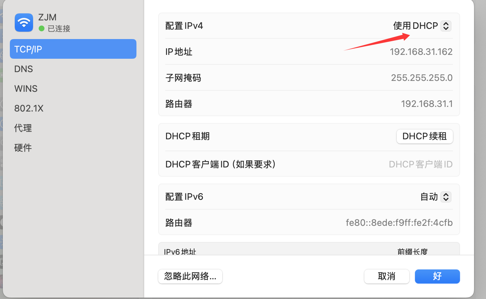
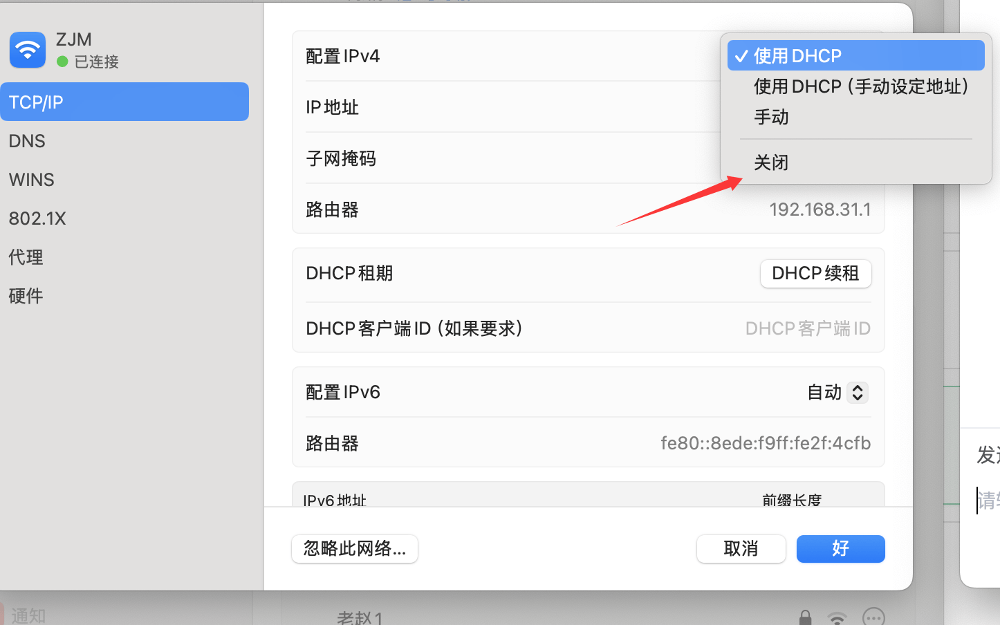

服务器：7\*24运行, 运行特定服务软件, 温度高, cpu和内存配置高
 ||
数据库: 服务器上管理数据的软件, 与服务器交互, 用户不可见

抓包: 客户端和服务器之间

挖src: 多看看IPv6, 需要先关掉IPv4, 有些新业务只部署在ipv6上




公网IP: 全球唯一, 光猫拨号
内网IP: 固定区域

IP欺骗: 修改IP数据包的源地址字段, 使服务器误以为请求来自其它IP
- IP有白名单限制时使用
- 仅限本地用户优惠
- 绕过速率限制和放爆破机制
- 绕过SSRF: 8进制, 16进制

```
X-Forwarded-For: 127.0.0.1
```

域名: 从右往左解析, 年付费
- 域名接管, 抢注控制

端口: 一个主机中, 0-65535, 0-1023是标准服务
- 80, 443, 3306
- 端口漏洞: 用nday poc直接打, 从fofa/鹰图上搜索

DNS: 本地->运营商DNS->根域名服务器
- `nslookup`: 查看解析命令, 从本地缓存中查找
- `vim /etc/hosts` 改我的MAC地址, 访问到不可访问的内容

CDN绕过: 查DNS历史, 未接入CND的子域名, 来找到源站IP
- 将网站内容缓存到各地边缘节点, 为了快速响应分布请求
- 可以隐藏源站, 攻击无法达到源站
- 站长之家ping, 如果IP都不一样, 那就是有CDN

常见CDN历史绕过方式

通配符记录: `*.example.com`
泛解析: 任何未单独配置的子域名都会解析到同一IP
- 看指向的IP是否相同

子域名接管(云服务器/存储桶): 临时活动服务器, 注册到公司子域名下, 服务器过期回收后没有解除dns记录, 该子域名依旧指向这台服务器

存储桶(腾讯cos/阿里oss): 存储图片文件, 没有页面服务, 一个大网盘, 域名很长
- 路径直接访问会得到一个XML, 访问一个子路径会得到ERROR
- AK SK泄露, 可以直接接管增删改查
- NoSuchBucket, 访问不到, 可以去对应厂商申请指定存储桶, 接管
- PUT/DEL请求方法, 任意写入/删除, 返回200/201, 再去访问对应路径测试
- 可直接访问, 里面有重要内容也是漏洞

信息收集, 资产更多 > 手法

服务器漏洞和数据库注入式最常见的文本攻击入口
- 系统漏洞, 服务配置, 认证薄弱(弱口令ssh和远程桌面), 文件上传
- SQL注入, 配置暴露, 中间件漏洞(redis未授权访问, tomcat弱口令)

