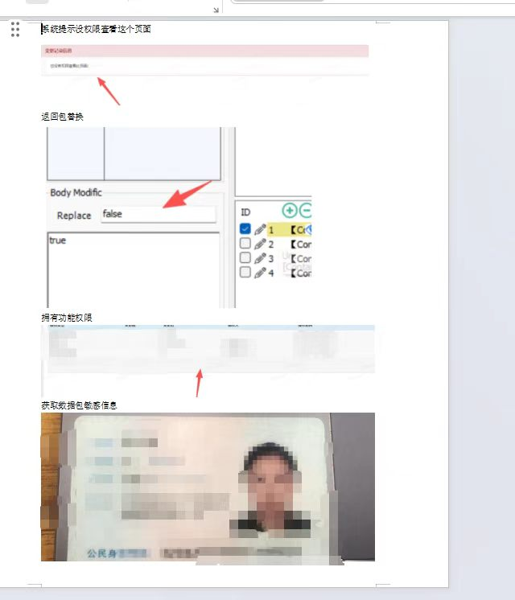

非法侵入，
src不得公开报告和内容

## Burpsuite
抓小程序：系统设置开代理服务器全局`127.0.0.1:8080,http` (可以用fd代替)

### Intruder 爆破
3位以上不建议全量跑
记得限速防止违规
不要做删除和修改的遍历
5位, 一次性只选其中三位数
## Fiddler
默认全局代理
`capture traffic` F12
Options->Actions 安装证书

### 和bp联动
Options->Gateway 设置bp的默认代理端口
所有经过fd的流量都会显示到bp上
全局流量转发到bp, 相当于在系统设置中打开代理

### 测并发
shift+u, 设置并发条数转发
主要用来测领取礼包, 占便宜的时候
万物皆可并发
### free HTTP
用来改返回包, 直接放到安装目录下

+设置返回包匹配策略
url filter设置匹配域名, `.`代表全部包, 查找并修改匹配所有内容
body modific修改包内容
- `false`改成`true`可能会多很多功能按钮可测试
返回包出现黄条为修改成功

```
有些身份字段, 修改后前端显示更多东西, 获得更多测试点
并不代表出洞
如果后端校验了, 功能不能用, 也没有用, 需要实际利用功能
找鉴权点
```

```
有时候false改true会影响界面进不去 找个被影响的参数 如NO:false改true 在free http创建一个被改的完整参数NO:true改回false 页面就可以进去了

替换js的debugger可以绕过反调试
```


```
给大家讲下这个漏洞原理，这个漏洞他的功能点是资质变更，因为我本身账号没这个功能点权限，但是我当时注意到他到返回包有这个flase我就尝试改成true了就拥有这个功能权限，这个时候本质不是漏洞，但是功能点接口数据我能调用所以这个就完全是一个经典的未授权案例
```

把百度变灰